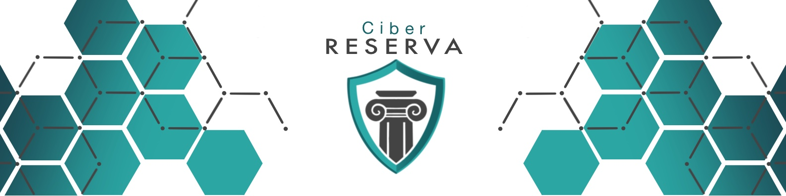

# Writeup

|  |
|:----------: |
| CiberReserva designs by [Heksiah](https://twitter.com/Heksiah) |

The Writeup is available in the following languages:
- [**English Version**](README_EN.md)
- [**Spanish Version**](README_ES.md)

## Why

This project is about the resolution of the CTF of the Final Phase of the Bitup Alicante 2021 event.

This challenge consisted of a Boot2Root style CTF in an Active Directory. The idea was to recreate a business environment as realistic as possible (within the idea that it is a CTF) and allow 3 teams to compromise the 6 machines involved in the domain.

The fictitious company created for the setting has been named "La CiberReserva" (whose setting has been borrowed from the series La Casa de Papel).

The objective is that the participants of the challenge approach a scenario a little bit similar to what you could find in a Red Team exercise (obviously the solution will not be the one of a Red Team exercise, this writeup is far from that). The idea is to take a different approach to cybersecurity challenges and tackle complex business environments.

## Acknowledgments

I want to thank the people who have helped in the development of this challenge and without them it would not have been possible:

- [Mussu](https://twitter.com/0xmussu) and [MrP](https://twitter.com/_mrp314) for helping me design and build the Active Directory machines. Without them the challenge would never have seen the light.
- To [Etnum](https://twitter.com/the_etnum) for helping me with the Writeup and his infinite patience.
- To [Rocio](https://twitter.com/macacosgelados) for helping me with the Writeup translations.
- To [Jari](https://twitter.com/_Laox) and [Atlas](https://twitter.com/DaniLJ94) for testing the challenge, validating that everything was working correctly and discovering some bugs (;
- To L for giving me a hand with the infrastructure issues
- To [Heksiah](https://twitter.com/Heksiah) for those fantastic designs of La CiberReserva.
- To the 3 finalist teams, who participated in this final phase and did their best to get the flags!
- To the [Staff of Bitup Alicante](https://twitter.com/bitupalicante/) that, after several years, leaves the skin in each event to make it great.
- To [Kaspersky](https://twitter.com/KasperskyES) for being an official sponsor and assuming the cost of all CTF prizes. They have been there for many years and we can always count on them! Thank them for their trust.

And to all those who read this writeup, share it and value the effort and dedication involved in making this kind of challenges.

I hope you liked it and that it motivates you to develop projects, challenges, tools or anything else (:

## Author

Any questions, thanks or insults:

- Tg: [@Secury](https://t.me/secury)
- Twitter: [@secu_x11](https://twitter.com/secu_x11)
