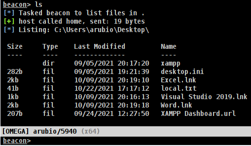
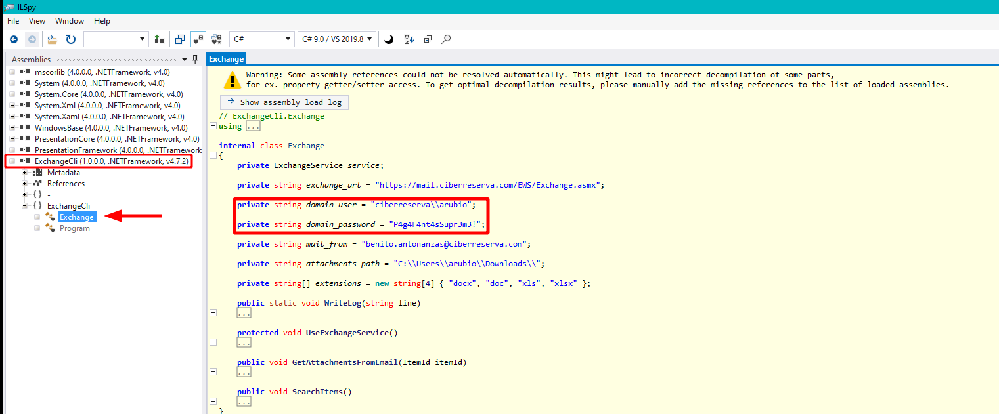
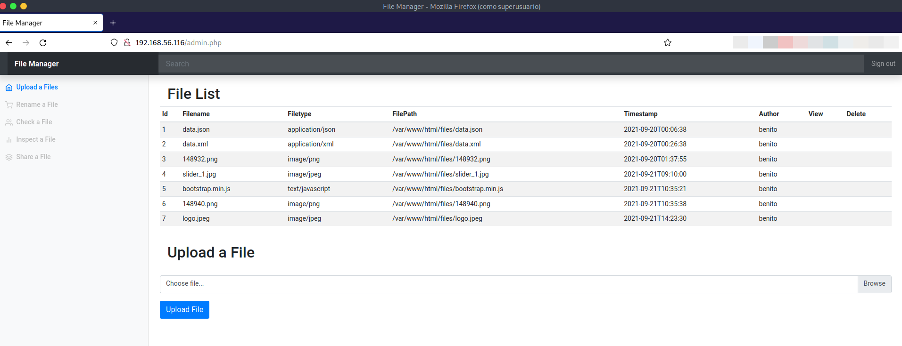
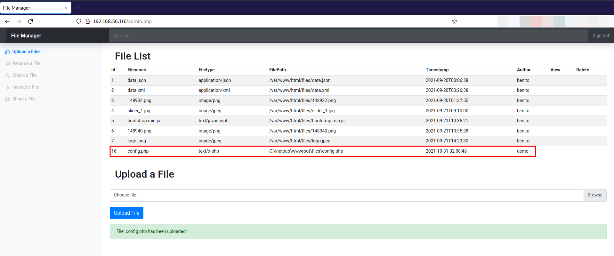
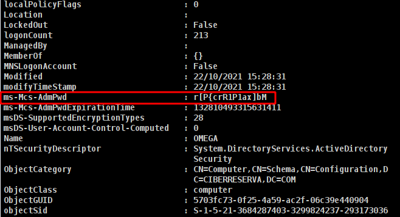
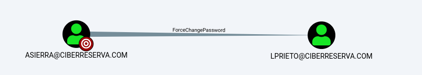

# Writeup

|  |
|:----------: |
| Diagrama de la resolución del reto |

## Index

[[_TOC_]]

## Acceso VPN

Cada participante del reto recibe un pack VPN que contiene un README.md con una explicación acerca de la infraestructura, las reglas y otros detalles del reto. También se entrega en el pack un archivo de configuración de Wireguard para conectarse a las máquinas involucradas en el reto.
Como cliente de VPN, se utiliza [Wireguard](https://www.wireguard.com/), un excelente servicio VPN que recomiendo mucho debido a la sencillez y la potencia que aporta. Al conectarse a la VPN se tendrá acceso al segmento de red 192.168.56.0/24 donde se encuentran las 6 máquinas involucradas.

## OSINT y reconocimiento perimetral

El reto comienza tras validar que se tiene visibilidad de la máquina 192.168.56.111 (LAMBDA), una de las máquinas de la infraestructura. Se comienza realizando un escaneo de servicios para verificar a qué máquinas se tiene visibilidad y qué servicios tienen expuestos.
Mientras se escanea, se procede a realizar un pequeño OSINT acerca de la empresa "ficticia" del reto: **La CiberReserva**. Comenzamos echando un vistazo al dominio principal: https://ciberreserva.com.
Tras realizar un breve análisis, se puede verificar que se trata de una simple página web estática.

|  |
|:----------: |
| Vista de la página web https://ciberreserva.com |

Se procede a analizar el Github principal de la CiberReserva: https://github.com/LaCiberReserva

|  |
|:----------: |
| Github de la Empresa https://github.com/LaCiberReserva |

Analizando los repositorios se puede encontrar la página web, la cual parece estar montada con Github Pages (se puede confirmar que es una página web completamente estática), y también otros repositorios que parecen no tener información de interés.
No obstante, se puede apreciar que hay 2 perfiles vinculados a la Empresa: Luis Tamayo y Benito Antoñanzas. En el perfil de Luis Tamayo no parece haber nada, en cambio en el perfil de Benito Antoñanzas pueden encontrarse varios repositorios.

|  |
|:----------: |
| Github del usuario Benito Antoñanzas https://github.com/benito-antonanzas |

### Obtención de las credenciales de dominio de Benito Antoñanzas de un commit de GitHub

Explorando los proyectos de Benito Antoñanzas, se puede ver como tan sólo uno de ellos: "ADTools" es un proyecto propio. El resto son forks de otros repositorios. Al indagar entre los commits de este repositorio, se descubre que, en uno de ellos, se hardcodean unas credenciales de un usuario de dominio que, posteriormente, son eliminadas en otro commit.

|  |
|:----------: |
| Credenciales de dominio hardcodeadas en script de PowerShell <br> https://github.com/benito-antonanzas/ADTools/commit/77d0c1923263dc10ad77f4a03259833fd38330cd |

Otra forma de hacer esto es utilizando la herramienta [Fozar](https://github.com/blackarrowsec/fozar) de BlackArrow, que te permite realizar una búsqueda por expresiones regulares y patrones en los commits de uno o múltiples repositorios. La herramienta puede ejecutarse con el siguiente comando:

|  |
|:----------: |

| Ejecutando Fozar para buscar credenciales en los repositorios de Benito Antoñanzas |
Al ejecutar la herramienta se genera un reporte en distintos formatos en el cual, para este caso, se puede ver cómo se obtienen las credenciales de dominio de la misma forma.

|  |
|:----------: |
| Credenciales de dominio descubiertas de Benito Antoñanzas con Fozar |

## Primer acceso a OMEGA

Se puede pensar que, el usuario Benito Antoñanzas, estaba probando los scripts de PowerShell y, al hacer un commit se olvidó que había dejado sus credenciales en el script y luego las borró en el siguiente commit.

Con la información obtenida, se puede comenzar el proceso hasta comprometer la primera máquina de la Infraestructura.

### Acceso al OWA con credenciales de dominio de Benito Antoñanzas

Tras revisar los resultados del escaneo, se encontraron varios puertos abiertos en la máquina 192.168.56.111 (LAMBDA).

|  |
|:----------: |
| Resultados de PortScan contra LAMBDA |

Tras hacer un breve análisis de los puertos, se centra la atención en el puerto 443, donde parece ser que hay un OWA activo.

|  |
|:----------: |
| OWA expuesto en puerto 443 de LAMBDA |

Con las credenciales de Benito Antoñanzas, se consigue acceder al buzón de correo del usuario.

|  |
|:----------: |
| Acceso al buzón de correo de Benito Antoñanzas utilizando las credenciales obtenidas en Github |

### Internal Spearphishing Attachment and compromise of user Angel Rubio

Tras revisar los correos enviados y recibidos, se puede observar cómo el usuario comprometido ha enviado algunos informes al usuario Angel Rubio. Los archivos adjuntos de los correos se trata de documentos ofimáticos "doc" y "xls". Esta información sugiere que se podría realizar un Spearphishing Interno contra este usuario y conseguir así comprometerlo.

Para realizar esto, se descarga uno de los archivos enviados por Benito Antoñanzas. Se modifica el documento sobre el cual, se inyecta una macro con código VBA. Esta macro descargará un archivo EXE al directorio C:\Windows\Tasks y lo ejecutará.

El archivo que se descarga se trata de un loader, que carga en memoria una shellcode de un beacon de CobaltStrike. Para evadir las posibles medidas defensivas que hay en la máquina se utiliza una técnica de Shellcode Execution with Native Windows Functions. Puedes leer sobre esta técnica [en el post de adepts.of0x.cc](https://adepts.of0x.cc/alternatives-copy-shellcode/). A continuación un ejemplo del código utilizado:

```cpp
#include <Windows.h> 
 
int main(int argc, char** argv)
{
    char orig_shellcode[CRYPT_SHELLCODE_LEN] = { 
        CRYPT_SHELLCODE_STR
    }; 
 
    char key[XOR_KEY_LEN] = {
        XOR_KEY_STR
    }; 
 
    BOOL ret = 0; 
 
    int orig_shellcode_len = sizeof(orig_shellcode) / sizeof(orig_shellcode[0]); 
    for (int i = 0; i < orig_shellcode_len; i++) { 
        int j = i % sizeof(key) / sizeof(char); 
        orig_shellcode[i] = orig_shellcode[i] ^ key[j]; 
    } 
 
    HANDLE heap = HeapCreate(HEAP_CREATE_ENABLE_EXECUTE, 0, 0); 
    char* copied_shellcode = (char*)HeapAlloc(heap, 0, 0x10); 

    SetConsoleTitleA(orig_shellcode); 
    GetConsoleTitleA(copied_shellcode, MAX_PATH); 

    EnumSystemCodePagesW(copied_shellcode, 0); 

    return 0; 
}
```

Una vez se tiene compilado el cargador, se utiliza la funcionalidad de "Host File" de Cobalt Strike para que se pueda descargar el archivo vía HTTP.
Después de esto, se procede a editar el documento a enviar, se crea la macro que se ejecutará con la apertura del archivo.

|  |
|:----------: |
| Creando Macro en el documento ofimático |

Esta macro ejecutará un comando en PowerShell que se descargará el cargador del Beacon de Cobalt y lo ejecutará. No es la opción más elegante y stealthy, pero para evadir las defensas del endpoint será suficiente.
Para generar el comando powershell codificado en base64, se puede hacer con: `echo 'POWERSHELL_CODE_HERE' | iconv --to-code UTF-16LE | base64 -w 0`

|  |
|:----------: |
| Dropper VBA en Macro del documento ofimático |

Una vez empaquetada la Macro en el documento, se procede a enviarlo al usuario Angel Rubio con un mensaje sugerente (en realidad no es necesario).

|  |
|:----------: |
| Envío de doc malicioso al usuario Angel Rubio |

Tras enviar el correo, pasados unos minutos, se recibe una petición HTTP al Teamserver donde se ve como se descarga el cargador de CobaltStrike. Poco después se recibe un Beacon en la máquina OMEGA del usuario Angel Rubio, confirmando así que la víctima se ha descargado y abierto el documento malicioso.

|  |
|:----------: |
| Descarga del cargador de Cobalt Strike vía HTTP |

|  |
|:----------: |
| Recibiendo Beacon de Cobalstrike del usuario Angel Rubio en la máquina OMEGA |

Desde el Beacon de Angel Rubio en OMEGA, se consigue leer la flag de user.

|  |
|:----------: |
| Obteniendo flag de usuario en OMEGA |

### Reconocimiento del dominio con Bloodhound

Una vez se ha comprometido a un usuario de dominio y se tiene visibilidad con el DC, se procede a realizar una enumeración del Dominio utilizando [SharpHound](https://github.com/BloodHoundAD/SharpHound3).

|  |
|:----------: |
| Enumeración del Dominio utilizando Sharphound desde CobaltStrike |

Esta información será analizada posteriormente con la herramienta [Bloodhound](https://github.com/BloodHoundAD/BloodHound) para descubrir posibles paths de compromiso en Dominio.

### Socks Proxy con webshell en servidor XAMPP

Tras analizar la máquina OMEGA, se puede encontrar en el Escritorio de Angel Rubio una carpeta del software XAMPP.

|  |
|:----------: |
| Carpeta XAMPP Server en Escritorio de Angel Rubio |

Esto indica que el usuario Angel Rubio es capaz de levantar un servidor HTTP en la máquina OMEGA. Se procede a levantar el servicio y se verifica que este es expuesto en 0.0.0.0, lo que significa que es posible acceder a él desde la VPN.

|  |
|:----------: |
| Levantando XAMPP Server en OMEGA |

|  |
|:----------: |
| XAMPP Server bindeado en 0.0.0.0:8001 |

|  |
|:----------: |
| Accediendo a servicio web de XAMPP Server desde la VPN |

Aprovechando esta capacidad, se plantea el siguiente escenario:

- Como el servicio web se está ejecutando con el usuario Angel Rubio, y este no dispone de privilegios en la máquina OMEGA, no se puede utilizar para elevar privilegios.
- No obstante, se puede escribir una webshell en servicio web y utilizar la webshell para comunicarse con el resto de máquinas de la infraestructura.
Esto puede hacerse con la herramienta [Pivotnacci](https://github.com/blackarrowsec/pivotnacci) de BlackArrow, que permitirá crear un Proxy Socks aprovechando la webshell y conseguir así tener visibilidad del resto de máquinas del dominio que no son accesibles desde la VPN.
Para hacerlo, simplemente se clona el proyecto de Github, se modifica el agente en PHP, y se sube al directorio web del XAMPP.

|  |
|:----------: |
| Modificando agente PHP de Pivotnacci que será subido al directorio del XAMPP |

Posteriormente se ejecuta el script en python pivotnacci.py que levantará un Servidor Socks en la máquina del atacante el cual se puede utilizar con proxychains para acceder a servicios web que desde la VPN no se podía: `pivotnacci http://192.168.56.110:8001/dashboard/info.php --password "c1b3rr353rv4" -A 'Mozilla/5.0 (Windows NT 10.0; Win64; x64) AppleWebKit/537.36 (KHTML, like Gecko) Chrome/74.0.3729.169 Safari/537.36' -v`

|  |
|:----------: |
| Creando Tunel Socks con Pivotnacci y accediendo a servicio web de una máquina interna |

### Obtención de las credenciales de dominio de Angel Rubio a partir de un NET Assembly

No obstante, antes de seguir explorando las posibilidades que nos aporta Pivotnacci, se da un paso atrás y se centra la atención en uno de los correos que figuraban en el buzón de Benito Antoñanzas:

|  |
|:----------: |
| Correo de interés enviado por Angel Rubio a Benito Antoñanzas |

En este correo Angel Rubio hace mención de un programa que se comunica con el servidor Exchange y en el cual, ha hardcodeado sus credenciales. La pista es más que evidente. Se procede a inspeccionar el directorio C:\ExchangeCli en OMEGA y se encuentra un binario llamado "ExchangeCli.exe". Se procede a descargar este binario a la máquina del atacante para analizarlo en el laboratorio.

|  |
|:----------: |
| Descubriendo y descargando binario ExchangeCli.exe en OMEGA |

Al analizar el binario, se descubre que es un NET Assembly, lo que significa que al estar desarrollado en .NET, el código fuente es convertido a código CIL (lenguaje intermedio), y se puede decompilar y obtener el código fuente. Para hacer esto, se utiliza la herramienta [ILSpy](https://github.com/icsharpcode/ILSpy). Y tras analizar el código fuente (que no se encuentra ofuscado), se pueden ver las credenciales de dominio del usuario Angel Rubio.

|  |
|:----------: |
| Credenciales del usuario de dominio Angel Rubio al decompilar el NET Assembly |

### Acceso al OWA con credenciales del dominio de Angel Rubio

Se utilizan estas credenciales de Angel Rubio para acceder a su buzón en el OWA. Tras analizar los correos enviados y recibidos, se puede descubrir un mensaje del usuario Luis Prieto que le indica que debe subir unos informes a un servicio web situado en http://kappa.ciberreserva.com:8000.

|  |
|:----------: |
| Correo enviado por Luis Prieto a Angel Rubio |

Para acceder a este servicio web, previamente se descubre la IP de la máquina "KAPPA" y se añade al hosts, para posteriormente utilizar el túnel de Pivotnacci desde el navegador web y poder acceder al servicio web.

|  |
|:----------: |
| Accediendo a servicio web en el puerto 8000 de Kappa a través del Pivotnacci |

## Primeros pasos en KAPPA

A partir de aquí se comenzará a indagar en la máquina KAPPA y sus servicios expuestos.

### Union Based SQL Injection en servicio web

Analizando el servicio web del puerto 8000, se encuentra un endpoint que parece listar contenido de "posts" en función a un identificador.

|  |
|:----------: |
| Listando posts en http://kappa.ciberreserva.com:8000 |

Fácilmente se comprueba que es vulnerable a SQL Injection.

|  |
|:----------: |
| Inyección SQL en endpoint http://kappa.ciberreserva.com:8000/post.php?id=1 |

Tras hacer una validación rápida, se comprueba que se trata de una Union Based SQL Injection. Lo cual significa que se puede explotar con relativa facilidad.

|  |
|:----------: |
| Obteniendo nombre y versión de la Base de Datos explotando la Union Based SQL Injection |

Se listan las tablas existentes en la base de datos:

|  |
|:----------: |
| Listando las tablas de la Base de Datos |

La tabla "users" parece que puede ser interesante, por tanto, se listan sus columnas:

|  |
|:----------: |
| Listando las columnas de la tabla "users" |

Entre las columnas listadas, hay varias interesantes, se procede a listar algunas de ellas:

|  |
|:----------: |
| Listando los valores de las columnas "id", "email" y "password" de la tabla "users" |

Y al revisar los resultados se puede ver como las contraseñas parecen ser hashes Bcrypt. Se descarta realizar un ataque de reverse lookup sobre estos hashes debido a la complejidad del algoritmo utilizado. Se continúa explorando y se procede a mostrar los valores de la columna "pass", pero al intentarlo, se obtiene un error:

|  |
|:----------: |
| Intentando listar los valores de la columna "pass" de la tabla "users" |

Se continúa investigando el alcance de la Inyección SQL, y se procede a listar qué Bases de Datos hay en el MySQL. Y se encuentra que hay dos: "cbms" (la que se acaba de dumpear) y "fmanager" (esta no se ha investigado).

|  |
|:----------: |
| Listando Bases de Datos en el MySQL |

Se listan las tablas de la Base de Datos "fmanager".

|  |
|:----------: |
| Listando las tablas de la base de datos "fmanager" |

Se listan las columnas de la tabla "users":

|  |
|:----------: |
| Listando las columnas de la tabla "users" de la base de datos "fmanager" |

Llegados a este punto se descubre por qué no se podía listar la columna "pass", y es que esta columna pertenece a la tabla "users" de la Base de Datos "fmanager". Por tanto, al listar las columnas de la tabla "users" y no filtrar por base de datos, aparecen todas las columnas mezcladas. De aquí se puede extraer otra conclusión importante, y es que el usuario que se utiliza para hacer las consultas SQL tiene, mínimo, el privilegio de SELECT sobre ambas bases de datos.

Se continua listando los valores de las columnas "id", "email" y "pass":

|  |
|:----------: |
| Listando los valores de las columnas "id", "email" y "pass" de la tabla "users" de la base de datos "fmanager" |

Y en estos valores se descubren hashes MD5 de algunos usuarios interesantes. Se procede a realizar un reverse lookup para obtener el valor hasheado en la plataforma https://md5online.org. Pero tan sólo se consigue obtener la contraseña en plano del usuario "demo".

|  |
|:----------: |
| Obteniendo contraseña del usuario "demo" utilizando un reverse lookup con md5online.org |

Ahora bien, si se intenta acceder al login de http://kappa.ciberreserva.com:8000/login.php con las credenciales del usuario "demo", se obtiene un error que indica que las credenciales no son válidas. Tras analizar la información obtenida, se plantea la posibilidad de que la base de datos "fmanager" pertenezca a otra aplicación web que esté en KAPPA.

Si se visita el puerto 80 de KAPPA, se encontrará otro servicio web cuyo título indica "File Manager".

|  |
|:----------: |
| Servicio Web "File Manager" en http://kappa.ciberreserva.com (192.168.56.116) |

Si se utilizan las credenciales descubiertas en este login, se consigue acceder a la sección administrativa.

|  |
|:----------: |
| Accediendo a sección administrativa de http://kappa.ciberreserva.com con credenciales validas |

### Arbitrary File Upload en servicio web IIS

En la sección administrativa del "File Manager" se puede observar que la única funcionalidad disponible es un panel de subida de archivos. El siguiente paso consiste en subir una webshell ya que no parecen haber filtros para bloquear la subida de archivos PHP.

|  |
|:----------: |
| Subiendo webshell PHP en http://kappa.ciberreserva.com |

Se verifica previamente que el servidor web se trata de un Microsoft-IIS/10.0, y el usuario con el que se ejecutan los comandos de la webshell es "NT AUTHORITY\IUSR".

### Elevación de privilegios aprovechando SeImpersonate Privilege con EfsPotato

Listando los privilegios de este usuario se puede comprobar que tiene el privilegio SeImpersonate, lo que significa que se puede aprovechar este token para conseguir elevar privilegios a "NT AUTHORITY\SYSTEM".

|  |
|:----------: |
| Ejecución de comandos desde la webshell y privilegio SeImpersonate con el usuario "IUSR" |

Para comprometer la máquina KAPPA, al tratarse de una máquina interna y no poder llegar directamente a la máquina del atacante, se sube con el "File Manager" una versión del Cargador de CobaltStrike con un beacon NamedPipe.

|  |
|:----------: |
| Subiendo cargador de CobaltStrike con Beacon NamedPipe en KAPPA |

Para realizar la elevación de Privilegios a "NT AUTHORITY\SYSTEM", se utilizará la herramienta [EfsPotato](https://github.com/zcgonvh/EfsPotato). Se sube al servidor web y se ejecuta el EfsPotato.exe pasando como argumento la ruta del cargador de CobaltStrike con Beacon NamedPipe.

|  |
|:----------: |
| Ejecutando cargador de CobaltStrike con Beacon NamedPipe utilizando EfsPotato |

Al ejecutar este binario, se creará una namedpipe en KAPPA a la que se podrá conectar desde el Beacon de OMEGA, creando así un túnel SMB entre ambas sesiones y pudiendo interactuar en las dos.

|  |
|:----------: |
| Conectando a la NamedPipe de KAPPA desde el Beacon de OMEGA |

Una vez se realiza el link con la NamedPipe se recibe un Beacon como "NT AUTHORITY\SYSTEM" en KAPPA.

|  |
|:----------: |
| Recibiendo Beacon de KAPPA con el usuario "NT AUTHORITY\SYSTEM" |

Con el Beacon de "NT AUTHORITY\SYSTEM" sobre KAPPA, se consigue acceder a la flag de root:

|  |
|:----------: |
| Obteniendo flag de root en KAPPA |

### Reconocimiento del dominio con Bloodhound

En este punto, si se ha realizado un buen análisis de la información recopilada con Sharphound, se puede observar como la cuenta de máquina de KAPPA (KAPPA$) tiene el permiso de ReadLAPS sobre OMEGA.

|  |
|:----------: |
| Descubriendo ReadLAPS de KAPPA$ sobre OMEGA con Bloodhound |

### Utilización del permiso ReadLAPS con KAPPA$ en OMEGA 

Una vez descubierto este permiso, se procede a obtener las propiedades del objeto de dominio OMEGA$ desde el Beacon con el usuario "NT AUTHORITY\SYSTEM" de KAPPA. Para hacer esto, se comprueba que en KAPPA está instalado el módulo de ActiveDirectory de PowerShell. Aprovechando este recurso, se puede ejecutar el siguiente comando: `powershell Get-AdComputer -Identity "OMEGA" -Properties *`.

|  |
|:----------: |
| Obteniendo las propiedades del objeto de dominio OMEGA desde KAPPA |

Al utilizar el Beacon con el usuario "NT AUTHORITY\SYSTEM" desde KAPPA, se consigue leer la propiedad "ms-Mcs-AdmPwd" de OMEGA, que contiene la contraseña en plano del Administrador Local de OMEGA. Esto sucede debido a que la cuenta de máquina de KAPPA (KAPPA$) tiene el permiso ReadLAPS sobre OMEGA y, al utilizar "NT AUTHORITY\SYSTEM", de cara a red, somos KAPPA$.

|  |
|:----------: |
| Obteniendo ms-Mcs-AdmPwd de OMEGA desde el Beacon con "NT AUTHORITY\SYSTEM" de KAPPA |

## Movimiento lateral a OMEGA

Con las credenciales del Administrador Local de OMEGA, se puede llevar el compromiso al siguiente nivel, y volver a OMEGA con privilegios de Administrador.
La forma más sencilla de hacer esto desde CobaltStrike, es utilizando la funcionalidad de "Spawn As" con las credenciales obtenidas.

|  |
|:----------: |
| Utilizando Spawn As de CobaltStrike con las credenciales de OMEGA\Administrador |

Una vez se ejecuta el Spawn As, se recibe un Beacon de CobaltStrike como "OMEGA\Administrador" en la máquina OMEGA.

|  |
|:----------: |
| Recibiendo Beacon de OMEGA con el usuario "OMEGA\Administrador" |

### Obtención de las credenciales de Cesar Gandía a partir de tareas programadas

Tras aterrizar en OMEGA y realizar determinadas tareas de post explotación, se encuentran varias tareas programadas en "C:\Windows\System32\Tasks".

|  |
|:----------: |
| Descubriendo Tareas Programadas en "C:\Windows\System32\Tasks" |

Al tratarse de archivos XML, se pueden descargar y abrir con un editor de texto. Y analizando el contenido de la tarea "Cesar Gandía Supervision" se puede apreciar que la tarea programada corre como el usuario Cesar Gandía y el tipo de "Logon" es con "Password".

|  |
|:----------: |
| Contenido de tarea programada "Cesar Gandía Supervision" |

Si se ha realizado una buena caracterización de la máquina OMEGA, se habrá podido ver que la máquina tiene configurada el WDigest, por tanto, las credenciales se almacenan en texto plano en lugar del Hash NT.

|  |
|:----------: |
| Clave de Registro con  habilitada |

Las credenciales del usuario Cesar Gandía de la tarea programada se pueden obtener de los vaults de la máquina, pero para ello es necesario elevar a "NT AUTHORITY\SYSTEM".

|  |
|:----------: |
| Listando Vaults de la máquina OMEGA |

|  |
|:----------: |
| Elevando a "NT AUTHORITY\SYSTEM" con el comando "elevate" de CobaltStrike |

|  |
|:----------: |
| Recibiendo Beacon de "NT AUTHORITY\SYSTEM" en OMEGA |

Tras elevar privilegios a SYSTEM, se pueden obtener las credenciales de César Gandía de los vaults con Mimikatz.

|  |
|:----------: |
| Obteniendo credenciales del usuario de dominio Cesar Gandía de los vaults de OMEGA |

Aunque se podría haber accedido a la flag con el usuario Administrador, utilizando el Beacon de "NT AUTHORITY\SYSTEM" sobre OMEGA, se accede a la flag de root:

|  |
|:----------: |
| Obteniendo flag de root en OMEGA |

## Llegada a EPSILON

Con las credenciales del usuario Cesar Gandía se abre un nuevo camino al resto de máquinas del dominio.

### Movimiento lateral a EPSILON mediante SSH con las credenciales de Cesar Gandia

De los resultados de Bloodhound, si se consulta la información acerca del usuario Cesar Gandía, se descubre que pertenece a un grupo de "Usuarios de Linux".

|  |
|:----------: |
| Descubriendo que César Gandía pertenece a un grupo de "Linux Users" con Bloodhound |

El pertenecer a este grupo así como la existencia de una máquina Linux en el dominio llamada EPSILON, sugiere que es posible utilizar las credenciales para acceder via SSH. Haciendo esto, se consigue obtener un Beacon en EPSILON con el usuario Cesar Gandía.

|  |
|:----------: |
| Utilizando las credenciales del usuario de dominio Cesar Gandía para acceder vía SSH a EPSILON |

|  |
|:----------: |
| Obteniendo Beacon como César Gandía en EPSILON |

Con el Beacon de César Gandía sobre EPSILON, se consigue acceder a la flag de usuario:

|  |
|:----------: |
| Obteniendo flag de usuario en EPSILON |

### Caracterización de EPSILON y análisis del binario Admintool con SUID bit

Con el Beacon en EPSILON, se comprueba que el usuario Cesar Gandía no tiene privilegios en la máquina. Al buscar paths de elevación de privilegios, se encuentran varios binarios con SUID bit. Uno de ellos sugiere que puede ser custom:

|  |
|:----------: |
| Binario admintool con SUID bit |

Se procede a descargarlo para poder analizarlo en el laboratorio:

|  |
|:----------: |
| Descarga de binario admintool desde CobaltStrike |

Al ejecutarlo en la máquina, se comprueba que este binario permite ejecutar determinados comandos en la máquina. No obstante, al introducir "caps", se muestra un mensaje que indica que no hay guía para el comando.

|  |
|:----------: |
| Funcionalidades disponibles en el binario admintool |

Se procederá a realizar reversing al binario para poder entender el funcionamiento interno. Si lo metemos a `IDA` para debuggearlo vemos lo siguiente:


En la lista de funciones ubicamos la función `main` y damos doble click, y veremos lo siguiente:


Este programa requiere de argumentos, así que tenemos que pasarle argumentos por IDA. Esto se hace desde `Debugger -> Process Options` y una vez dentro se rellenan en `Parameters`.


Y ahí en `Parameters` se ponen los parámetros que le quieres pasar al programa. Se le pasa `whoami` para analizar el flujo de ejecución. Se pone un breakpoint al principio del main y se le da al botón del play para que se abra en esta vista:


NOTA: `F7` == step in | F8 == step out

Se puede ver que en las primeras líneas lo que hace es verificar si le hemos pasado 1 o más argumentos:


Si se le ha pasado menos de 1 argumento salta a lo siguiente:


Dentro de esta rutina llama a otra función que es un menú de ayuda:


Y después una vez ejecutada, salta a una rutina la cual ejecuta el return del main.
En nuestro caso como se le ha pasado un argumento (`whoami`) seguirá el flujo de ejecución en la siguiente rutina, testeará si hemos pasado más de un argumento, si no es así, nos enviara a un mensaje de error y saldrá del programa:


Como le estamos pasando los parámetros correctamente seguiremos ejecutando la siguiente rutina:


En esta rutina lo que se está haciendo es ejecutar la función `setuid` y pasa una string encodeada como argumento a una función. Si seguimos el flujo de ejecución y nos metemos dentro de esta función vemos que al principio de la función saca la longitud de la string encodeada:


Después llama a una función y le pasa los siguientes argumentos:


Le pasa la longitud de la string encodeada y la string encodeada. Si debugeamos la función vemos que es una función que hace operaciones con los bytes de la string encodeada. Si nos colocamos al final de la función vemos lo siguiente:


En los registro tenemos lo siguiente:


Si le damos a la flechita azul nos lleva a donde está la dirección de memoria y podemos ver sus contenidos:


Vemos que esta función devuelve una serie de bytes que por el momento no entendemos. Sabemos que es dato de retorno ya que justo nada más que vuelve la función guarda eax en una variable: (revisar)


Después de esto se mete en una un bucle en el cual está haciendo un NOT (operación bitwise) a cada byte de lo que devuelve la última función:


El resultado de cada NOT lo guarda ahí:


Ejecutamos hasta el final del bucle para ver cuál es el valor final y vemos que en donde está rdx está el resultado de los NOT:


Vemos que es la string `whoami`, ahora sabemos que las strings encodeadas son los comandos. El final de la instrucción es lo siguiente:


Reserva en el heap una porción de memoria y mueve la string decodeada totalmente, después devuelve la dirección de memoria del heap. Una vez que ha decodeado la string, llama a una función y le pasa por argumentos nuestro argumento inicial y la string decodeada:


Si nos metemos a la función vemos lo siguiente:


Saca la longitud de nuestro argumento y de la string decodeada. Después chequea si las dos longitudes son iguales, si son diferentes salta a lo siguiente:


Mueve 1 a eax y ejecuta el ret, esto quiere decir que si las strings no son iguales, la función devuelve 1, en nuestro caso la longitud son iguales:


Si nos fijamos vemos que es un bucle:


Lo que está haciendo en el bucle es chequear que cada byte es de las dos strings son iguales, si las strings son iguales la función devuelve 0, si son diferentes devuelve 1. Entonces esta función es para comparar las strings. Si salimos de la función vemos que nada más salir hace la comprobación del resultado de la función:


Si el resultado es incorrecto (1) salta a comprobar otra string encodeada:


En cambio si el resultado es correcto (0) salta a lo siguiente:


Vuelve a decodear la string y pasa por argumento a un función, la string encodeada y nuestro argumento:


Vemos que decodea otra string la compara con nuestro argumento:


Si las strings son iguales ejecuta lo siguiente:


Al parecer setea una capability con la que podríamos escalar privilegios. En cambio si no son iguales ejecuta nuestro comando:


Una vez hecho esto se termina la función y también el programa. Una vez analizado el programa lo que vamos hacer es ver como conseguir ejecutar el la rutina que setea la capability para poder escalar privilegios. Si tu string no es `whoami` en vez de saltar a la rutina que llamar a la funciona para ejecutar comandos, saltara a la siguiente rutina que chequea si tu string es un `ls`:


Si tu string no es ni `whoami` ni `ls`, chequeará si es un `pwd`:


En cambio si pasas un `caps` como argumento se ve lo siguiente:


Vemos que chequea si la string es `caps`, si es así, chequea a ver si tiene más de dos argumentos, si no tiene más de dos argumentos muestra lo siguiente:


En nuestro caso ya he pre-configurado para pasarle más de dos argumentos (eso de pasarle más de un argumento veremos como sacarlo haciendo análisis estático). Si tiene más de dos argumentos hace lo siguiente:


Decodea la string "j4aLl5CR" y vemos que guarda nuestro argumento en eax, vemos que suma a eax 16, esto es para seleccionar el siguiente argumento. Vemos que una vez que hace la suma mueve nuestro argumento a eax, si vemos los contenidos vemos lo siguiente:


Vemos que ahora está seleccionado el parámetro prueba, que es el previamente configurado en IDA. Así es como podríamos saber que hay que utilizar dos argumentos. Lo que nos interesa es saber que es la string encodeada "j4aLl5CR", si ponemos un breakpoint ahí:


Y mirando los registros podremos ver la palabra decodeada.


Vemos que la string decodeada es `python`. El programa verifica que nuestro parámetro es `python`, vamos a cambiar nuestro parámetro a `python` y seguimos con el flujo de ejecución.


Una vez que volvemos a estar en el mismo punto de ejecución vemos que ahora en vez de saltar al mensaje de error nos salta a la rutina que ejecutará la funciona de ejecución de comandos:


Si seguimos el flujo de ejecución hasta dentro de la función que ejecuta comandos vemos que esta vez sí entra a la rutina que ejecuta el comando que setea la capability:


Entonces una vez reverseado el binario hemos conseguido saber que si ejecutamos `admintool caps python` seteamos como root la capability CAP_SETUID en el binario python3.8, esto marca una vía potencial para elevar privilegios.

### Explotación del binario Admintool y elevación con CAP_SETUID

Ahora bien, pensando en la explotación, y viendo que la idea es lanzarla desde el CobaltStrike, fabricamos un pequeño script que ejecutaremos desde el python3.8, una vez se haya puesto la CAP_SETUID. Este script simplemente creará un usuario local en EPSILON y lo añadirá al sudoers, de esta forma, se podrá usar este usuario para ejecutar comandos con sudo.

|  |
|:----------: |
| Subiendo script para la elevación de privilegios a EPSILON |

El siguiente paso consiste en disparar la asignación de capability sobre el binario python3.8 y utilizarlo para ejecutar el script que se acaba de subir.

|  |
|:----------: |
| Explotando el binario admintool para asignar CAP_SETUID al binario python3.8 y elevar privilegios con él |

Tras hacer esto, podemos proceder a conectarnos vía SSH con las credenciales del usuario creado y conseguir así un Beacon de CobaltStrike con un usuario con privilegios en EPSILON.

|  |
|:----------: |
| Conectándose vía SSH a EPSILON con las credenciales del usuario localuser |

|  |
|:----------: |
| Obteniendo Beacon de CobaltStrike con usuario privilegiado en EPSILON |

|  |
|:----------: |
| Ejecutando comandos con sudo en EPSILON utilizando el usuario localuser |

Con el Beacon de "localuser" sobre EPSILON, se consigue acceder a la flag de root:

|  |
|:----------: |
| Obteniendo flag de root en EPSILON |

### Descubrimiento del TGT de Alicia Sierra y exportación de tickets

Tras elevar privilegios, se procede a realizar la post explotación en EPSILON. Durante esta etapa, se encuentran unos tickets de Kerberos (TGTs) en el directorio /tmp. Estos tickets son de 2 usuarios: Cesar Gandía y Alicia Sierra.

|  |
|:----------: |
| Descubriendo tickets de Kerberos (TGTs) en el directorio /tmp de EPSILON |

Como el usuario Cesar Gandía ya está comprometido, se pone el foco en el TGT de Alicia Sierra. Se procederá a exportarlo y descargarlo para poder utilizarlo en otra máquina e impersonar a este usuario.

|  |
|:----------: |
| Descargando TGT de Alicia Sierra |

Ahora bien, el TGT está en formato ccache. Para poder importarlo en CobaltStrike y utilizarlo para impersonar al usuario Alicia Sierra, antes se debe convertirlo a formato kirbi (KRB-CRED). Para ello se puede utilizar la herramienta [ticket_converter](https://github.com/zer1t0/ticket_converter):

|  |
|:----------: |
| Convirtiendo TGT en formato ccache a formato kirbi con ticket_converter |

## Movimiento lateral a SIGMA

Con la credencial obtenida, se encara el nuevo camino que llevará al compromiso de la siguiente máquina.

### Pass the Ticket con TGT de Alicia Sierra

Para conseguir la impersonación del usuario Alicia Sierra, se realizará un ataque de Pass The Ticket con CobaltStrike. Se importará el TGT en formato kirbi en el Beacon de Angel Rubio sobre OMEGA.

|  |
|:----------: |
| Pass the ticket con el TGT del usuario Alicia Sierra desde OMEGA |

### Reseteo de contraseña del usuario Luis Prieto impersonando al usuario Alicia Sierra

Consultando las posibilidades que se tienen de movimiento lateral en Bloodhound, con el usuario Alicia Sierra, se descubre que este usuario tiene una ACL que permite cambiar la contraseña al usuario Luis Prieto.

|  |
|:----------: |
| Descubriendo con Bloodhound que Alicia Sierra tiene la ACL "ForceChangePassword" sobre Luis Prieto |

Para abusar de este permiso, se procede a cargar el módulo de Powerview en el Beacon de CobaltStrike y, aprovechando el Pass The Ticket se consigue realizar un cambio de contraseña de Luis Prieto exitoso con el siguiente comando: `$UserPassword = ConvertTo-SecureString 'Password123!' -AsPlainText -Force ; Set-DomainUserPassword -Identity ciberreserva\lprieto -AccountPassword $UserPassword`

|  |
|:----------: |
| Reset Password del usuario Luis Prieto utilizando PowerView |

### Compromiso de SIGMA aprovechando ReadLAPS usando el usuario de Luis Prieto

Este cambio de contraseña no es aleatorio. Si se investiga el alcance disponible utilizando al usuario Luis Prieto, se descubre que este usuario tiene el permiso ReadLAPS sobre la máquina SIGMA.

|  |
|:----------: |
| Descubriendo con Bloodhound que Luis Prieto tiene el permiso ReadLAPS sobre SIGMA |

Al no disponer del módulo de Active Directory, y por variar un poco, se utilizará la herramienta [ldapsearch](https://linux.die.net/man/1/ldapsearch) a través del túnel de pivotnacci para conseguir explotar el permiso ReadLAPS. Para esto, simplemente se tienen que proporcionar las credenciales del usuario a Ldapsearch y solicitar las propiedades del objeto de dominio "SIGMA$": `proxychains4 ldapsearch -H ldap://zeta.ciberreserva.com -x -D "lprieto@ciberreserva.com" -w "Password123!" -b "dc=ciberreserva,dc=com" "(sAMAccountName=sigma$)"`

|  |
|:----------: |
| Enumerando al objeto SIGMA utilizando ldapsearch a través del proxy socks |

|  |
|:----------: |
| Obteniendo ms-Mcs-AdmPwd de SIGMA |

## Acceso a SIGMA

Con las credenciales del Administrador Local de SIGMA, se puede hacer un movimiento lateral privilegiado a la máquina. Para ello se utilizará la funcionalidad de "jump" de CobaltStrike a través de PsExec.

|  |
|:----------: |
| Movimiento Lateral a SIGMA utilizando el módulo "jump" de CobaltStrike |

|  |
|:----------: |
| Impersonación con token de acceso de SIGMA\Administrador y ejecución de PsExec |

Tras la ejecución, se recibe un Beacon de CobaltStrike como "NT AUTHORITY\SYSTEM" en la máquina SIGMA.

|  |
|:----------: |
| Recibiendo Beacon como "NT AUTHORITY\SYSTEM" en SIGMA |

Con el Beacon de "NT AUTHORITY\SYSTEM" sobre SIGMA, se consigue acceder a la flag de root:

|  |
|:----------: |
| Obteniendo flag de root en SIGMA |

### Descubrimiento de Kerberos Unconstrained Delegation

Tras realizar una caracterización de la máquina, se puede comprobar que la máquina tiene configurada la Unconstrained Delegation de Kerberos.

|  |
|:----------: |
| Descubriendo con Bloodhound que Sigma tiene configurada la Unconstrained Delegation de Kerberos |

### Explotación de Kerberos Delegation y obtención de TGT de ZETA$ usando PrinterBug

Con el nivel de privilegios que se dispone y la configuración de la máquina, se plantea una posible vía de compromiso del dominio que consiste en lo siguiente:

- Se ejecuta Rubeus con el usuario "NT AUTHORITY\SYSTEM" en SIGMA, monitorizando los TGTs de la máquina.
- Desde SIGMA, se fuerza a la cuenta de máquina de ZETA (ZETA$), a autenticarse en SIGMA utilizando la vulnerabilidad de [PrinterBug](https://github.com/leechristensen/SpoolSample).
- Al autenticarse ZETA en SIGMA, como la máquina tiene configurada la Unconstrained Delegation de Kerberos, ZETA$ dejará su TGT en la máquina, que será capturado por el Rubeus.
- Con ese TGT, se puede impersonar a ZETA y conseguir escalar en el dominio.

|  |
|:----------: |
| Obteniendo TGT de ZETA$ explotando el PrinterBug y aprovechando la Unconstrained Delegation de Kerberos en SIGMA |

### Pass The Ticket como ZETA$ y DCsync

Con el TGT de la cuenta de máquina de ZETA (ZETA$), se puede realizar un Pass The Ticket, impersonar a ZETA y realizar así un Dcsync para obtener las credenciales de un Administrador de Dominio.
Para poder realizar esto, primero se decodifica el TGT obtenido con Rubeus, que estará en formato kirbi y se podrá importar desde CobaltStrike.

|  |
|:----------: |
| Decodificando el TGT de ZETA$ obtenido con Rubeus |

|  |
|:----------: |
| Pass The Ticket con el TGT de ZETA$ desde CobaltStrike |

Una vez impersonado, se procede a realizar un Dcsync con el usuario objetivo Luis Tamayo, que se trata de un Administrador de Dominio. El Dcsync se lleva a cabo utilizando el módulo de CobaltStrike que lo lleva implementado.

|  |
|:----------: |
| Obteniendo las credenciales del administrador de dominio Luis Tamayo utilizando la técnica de Dcsync |

## La joya de la corona, ZETA

Con las credenciales de Luis Tamayo (su hash NT), se puede realizar un ataque de Pass The Hash combinado con un "jump" de CobaltStrike para conseguir comprometer ZETA.

|  |
|:----------: |
| Pass the Hash como Luis Tamayo y ejecución de PsExec sobre ZETA |

|  |
|:----------: |
| Recibiendo Beacon como "NT AUTHORITY\SYSTEM" en ZETA |

Con el Beacon de "NT AUTHORITY\SYSTEM" sobre ZETA, se consigue acceder a la flag de root:

|  |
|:----------: |
| Obteniendo flag de root en ZETA |

## El último bastion, LAMBDA

Habiendo comprometido las credenciales de un Administrador de Dominio y del Controlador de Dominio, el compromiso del resto de máquinas es inevitable. El último paso es moverse a LAMBDA, la última en pie.

### Pass The Hash con el hash de Luis Tamayo a LAMBDA

Aprovechando el Pass The Hash como Luis Tamayo, se puede leer la flag remotamente:

|  |
|:----------: |
| Pass the Hash como Luis Tamayo y obteniendo flag de root de LAMBDA |

No obstante, como el objetivo es comprometer todas las máquinas del dominio, se realiza un "jump" sobre LAMBDA utilizando CobaltStrike.

|  |
|:----------: |
| Pass the Hash como Luis Tamayo y ejecución de PsExec sobre LAMBDA |

Finalmente, tras recibir el Beacon como "NT AUTHORITY\SYSTEM" en LAMBDA, se concluye la explotación habiendo comprometido las 6 máquinas del dominio con el mayor nivel de privilegios.

|  |
|:----------: |
| Diagrama con todas las máquinas de la CIBERRESERVA comprometidas |
